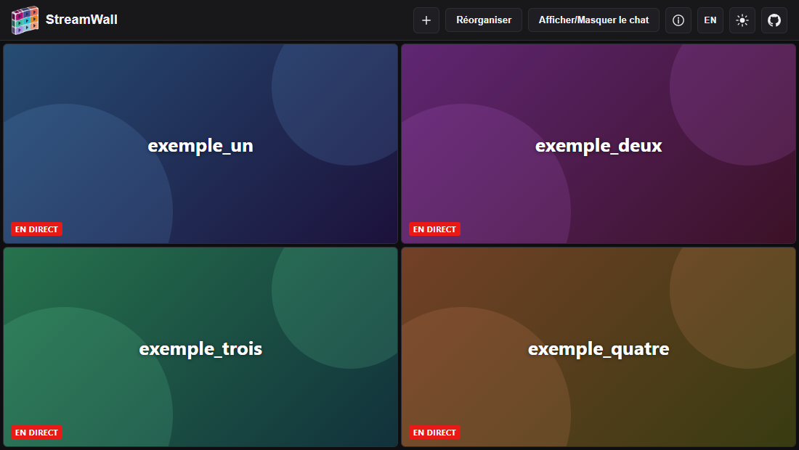
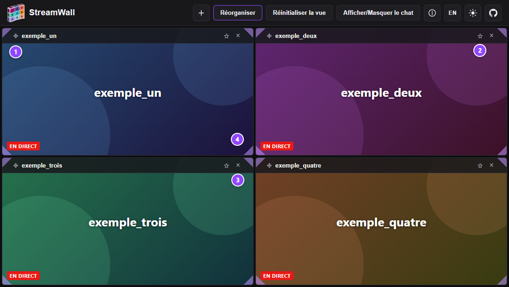
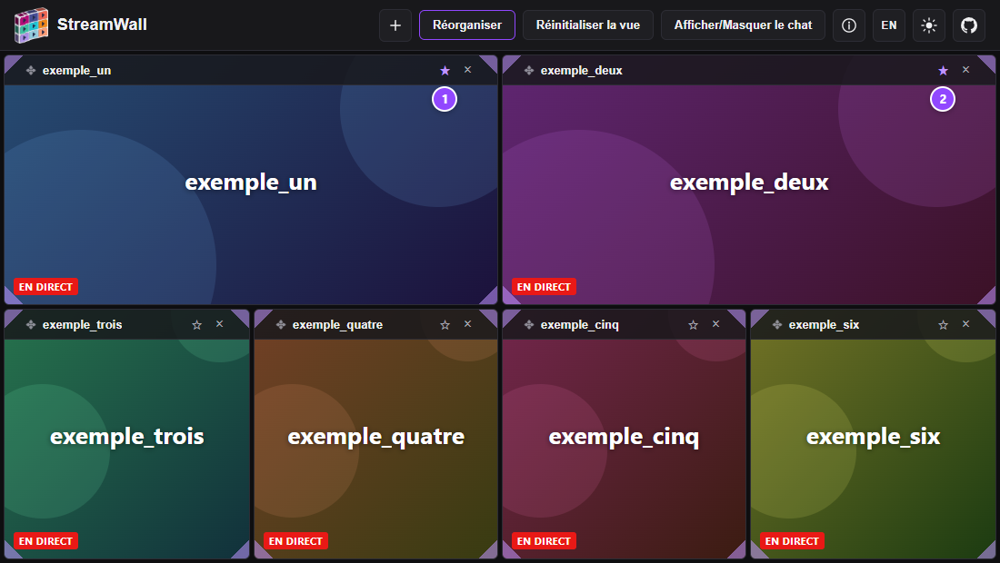
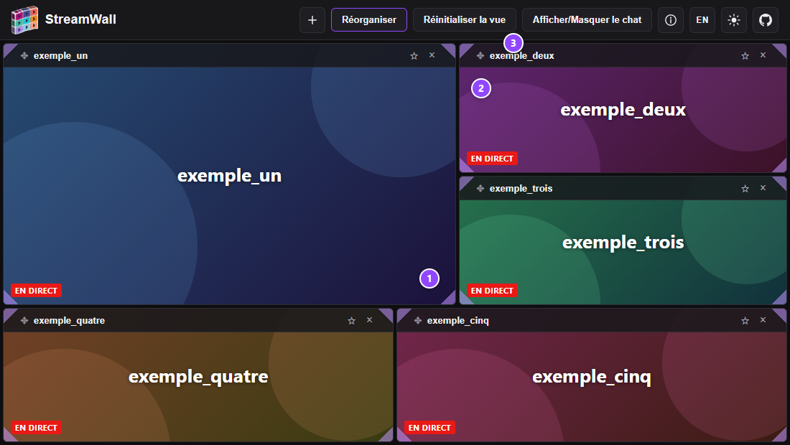
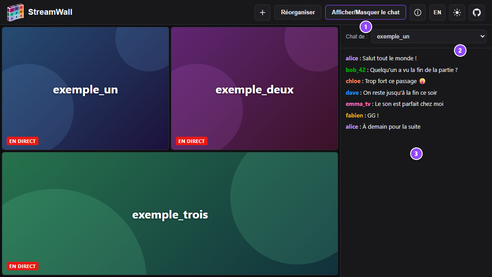
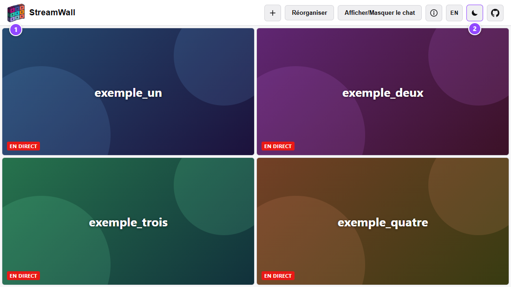

<div align="center">

<picture>
  <source media="(prefers-color-scheme: dark)" srcset="assets/logo_mode_sombre.png">
  <source media="(prefers-color-scheme: light)" srcset="assets/logo_mode_clair0.png">
  
</picture>

# StreamWall

**Regardez plusieurs streams Twitch en même temps, sur une seule page.**

Un mur de streams qui remplit toujours 100 % de l'écran, que vous réorganisez et redimensionnez à la souris.
100 % front-end : sans compte, sans serveur, sans étape de build.

[](https://developer.mozilla.org/docs/Web/HTML)
[](https://developer.mozilla.org/docs/Web/CSS)
[](https://developer.mozilla.org/docs/Web/JavaScript)
[](https://dev.twitch.tv/docs/embed/)


[](https://kur0n33k0.github.io/)

[**🌐 Voir le site en ligne**](https://kur0n33k0.github.io/) ·
[**🚀 Installation rapide**](#-installation-rapide) ·
[**📖 Documentation technique**](documentation.md)

</div>

---

## ✨ Présentation

**StreamWall** regroupe autant de streams Twitch que vous voulez sur une seule page, pour suivre un tournoi,
une soirée entre amis ou plusieurs points de vue d'un même événement.

- **Toute la place est utilisée** : les tuiles se partagent 100 % de la fenêtre, sans case vide et sans jamais de
  défilement, quel que soit leur nombre — même avec un seul stream.
- **Vous gardez la main** : glissez les tuiles pour les changer de place, mettez-en deux en avant, agrandissez
  n'importe laquelle par un coin — les autres se réorganisent autour d'elle pour continuer à tout remplir.
- **Vos réglages vous suivent** : enregistrez une *disposition favorite* (streams, ordre, favoris et taille des
  tuiles) et retrouvez-la en un clic, ou partagez un lien vers vos streams.
- **Rien à installer, rien à créer** : c'est un simple site statique. Aucun compte, aucun serveur — vos réglages
  restent dans votre navigateur.

StreamWall est une réimplémentation moderne, en JavaScript pur, du projet
[bhamrick/multitwitch](https://github.com/bhamrick/multitwitch), qui nécessitait à l'origine un serveur applicatif
Python.

## 🖼️ Aperçu

<table>
  <tr>
    <td align="center" width="50%">
      
      <br><sub><b>Le mur</b> : les tuiles remplissent tout l'écran</sub>
    </td>
    <td align="center" width="50%">
      
      <br><sub><b>Mode Réorganiser</b> : déplacer, mettre en avant, retirer, agrandir</sub>
    </td>
  </tr>
  <tr>
    <td align="center">
      
      <br><sub><b>Mise en avant</b> : jusqu'à deux streams à l'honneur</sub>
    </td>
    <td align="center">
      
      <br><sub><b>Redimensionnement par les coins</b> : les autres tuiles s'adaptent</sub>
    </td>
  </tr>
  <tr>
    <td align="center">
      
      <br><sub><b>Chat</b> : celui de la chaîne de votre choix</sub>
    </td>
    <td align="center">
      
      <br><sub><b>Thème clair et sombre</b>, logo compris</sub>
    </td>
  </tr>
</table>


## 🎛️ Fonctionnalités

**Le mur de streams**
- Nombre de streams illimité, disposition calculée en JavaScript pour occuper toute la zone, s'adaptant à la
  fenêtre (ordinateur comme téléphone).
- Un seul stream démarre avec le son (le premier stream mis en avant, sinon le premier affiché) : pas de cacophonie.
- Lecteurs officiels Twitch : pause, volume, qualité et plein écran comme d'habitude.

**Ajouter et gérer ses streams**
- Bouton **＋** toujours visible dans le menu : saisissez un nom de chaîne ou collez son adresse `twitch.tv/…`.
- Validation immédiate du nom, auto-complétion des chaînes déjà utilisées, cases à cocher pour masquer une chaîne
  sans l'oublier.

**Mode Réorganiser**
- **Glisser-déposer** de n'importe quel point d'une tuile, ou **flèches du clavier**.
- **Mise en avant** (★) de deux streams au maximum, qui occupent chacun un quart de l'écran, en haut.
- **Redimensionnement par les quatre coins** de chaque tuile, avec aimantation aux bords et bouton
  « Réinitialiser la vue ». Les tailles sont mémorisées.

**Dispositions favorites**
- Enregistrez la combinaison de streams affichée **avec son ordre, ses favoris et la taille de chaque tuile**.
- Un clic la rétablit ; un bouton copie un lien de partage vers ses streams.

**Confort**
- Panneau de **chat Twitch** (masqué par défaut) avec choix de la chaîne.
- **Site bilingue, français et anglais** : le bouton **EN / FR** du menu traduit toute l'interface, aide et captures
  comprises. Le choix est mémorisé, et `?lang=en` dans l'adresse ouvre le site en anglais.
- **Thème sombre ou clair**, avec un logo adapté à chacun.
- Lien vers le **code source** (logo GitHub, tout à droite du menu).
- **Fenêtre d'aide intégrée** (bouton ⓘ) avec captures d'écran : toutes les options du site y sont expliquées.
- Utilisable **au clavier**, avec gestion du focus dans les fenêtres.

## 🚀 Installation rapide

StreamWall est un site statique : il suffit de le servir avec n'importe quel serveur HTTP local.

```bash
git clone https://github.com/Kur0n33k0/kur0n33k0.github.io.git
cd kur0n33k0.github.io

# Au choix :
python -m http.server 8080      # Python (python3 sous macOS / Linux)
npx serve -l 8080               # Node.js, sans installation globale
php -S localhost:8080           # PHP
```

Ouvrez ensuite **http://localhost:8080**.

> [!IMPORTANT]
> N'ouvrez pas `index.html` directement (`file://`) : Twitch exige une origine HTTP valide pour intégrer ses
> lecteurs (paramètre `parent`, [détails](documentation.md#le-paramètre-parent-de-twitch-point-critique)).

## 🧭 Prise en main

| Je veux… | Je fais… |
| --- | --- |
| **Ajouter un stream** | Bouton **＋** du menu, puis le nom de la chaîne et *Entrée* |
| **Retirer un stream** | Mode **Réorganiser**, puis **×** sur la tuile (ou décocher la chaîne dans la fenêtre ＋) |
| **Changer des tuiles de place** | Mode **Réorganiser**, puis glisser une tuile sur une autre (ou les flèches du clavier sur sa barre) |
| **Mettre un stream en avant** | Mode **Réorganiser**, puis l'étoile **☆** de la tuile (deux au maximum) |
| **Agrandir une tuile** | Mode **Réorganiser**, puis tirer un de ses **quatre coins** |
| **Revenir aux tailles par défaut** | Mode **Réorganiser**, puis **Réinitialiser la vue** |
| **Retrouver une composition** | Enregistrez une *disposition favorite* dans la fenêtre ＋, puis cliquez sur son nom |
| **Partager mes streams** | Copiez l'adresse de la page (`…#chaine1/chaine2`) ou le lien d'une disposition favorite |
| **Tout comprendre** | Bouton **ⓘ** du menu : l'aide intégrée |

## 🛠️ Technologies

| | Technologie | Rôle |
| --- | --- | --- |
|  | **HTML5** | Page unique, fenêtres accessibles (`role="dialog"`) |
|  | **CSS3** | Thèmes par variables CSS, mise en page Flexbox, adaptation mobile |
|  | **JavaScript ES6+** (vanilla) | Toute la logique, en un seul fichier, sans framework ni bibliothèque tierce (hors SDK Twitch) |
|  | **Twitch Embed** | Lecteurs vidéo (SDK officiel) et chat (iframe officielle) |

**API du navigateur utilisées** : `localStorage` (mémorisation des réglages), `ResizeObserver` (recalcul de la
disposition), Pointer Events (redimensionnement souris, doigt et stylet), Drag and Drop HTML5, Clipboard.

**Traductions** : deux dictionnaires en JavaScript pur (`i18n.js`), sans bibliothèque ; l'aide existe en deux versions.
Voir [la documentation, section 17](documentation.md#17-langues-français--anglais).

**Sous le capot** : un petit solveur de découpage récursif (« guillotine ») pave la zone en rectangles pour garantir
100 % de remplissage, quelles que soient les tailles ajustées à la main.
Voir [le détail dans la documentation](documentation.md#fonctionnement-technique).

## 🌍 Déploiement

Le site n'a besoin d'aucune configuration : il se déploie tel quel sur n'importe quel hébergement de fichiers
statiques. Exemple avec **GitHub Pages** :

1. poussez le projet sur une branche (par exemple `main`) d'un dépôt GitHub ;
2. dans **Settings → Pages**, choisissez cette branche et le dossier racine `/` ;
3. le site est en ligne en quelques instants.

Le paramètre `parent` exigé par Twitch est calculé automatiquement d'après le nom de domaine de la page : rien à
modifier. Autres hébergeurs (Netlify, Vercel, Nginx, Docker…) :
[documentation, section Déploiement](documentation.md#déploiement).

## 🔒 Vie privée

StreamWall ne possède ni serveur ni base de données : **aucune donnée n'est envoyée à StreamWall**. Vos chaînes, vos
favoris, vos tailles de tuiles et vos dispositions favorites sont enregistrés dans le `localStorage` de *votre*
navigateur. Seuls les lecteurs et le chat, fournis par Twitch, communiquent avec Twitch et suivent ses propres
règles.

## 📁 Structure du projet

```
├── index.html              Page unique (structure HTML, référencement, texte de l'aide en français et en anglais)
├── style.css               Feuille de style (thèmes, mur de streams, fenêtres)
├── app.js                  Toute la logique de l'application, commentée en français
├── i18n.js                 Langues : dictionnaires français / anglais et moteur de traduction
├── robots.txt, sitemap.xml Référencement (moteurs de recherche)
├── assets/                 Logo (thème sombre / clair), favicon, image d'aperçu et captures de l'aide (FR / EN)
├── documentation.md        Documentation technique détaillée
└── README.md               Cette présentation
```

## 📖 Documentation

La **[documentation technique](documentation.md)** détaille le fonctionnement interne (17 sections : affichage des
streams, modèle de données, disposition dynamique, mise en avant, redimensionnement manuel, dispositions favorites,
fenêtre d'aide…), ainsi que :

- [Lancer le projet en local](documentation.md#lancer-le-projet-en-local)
- [Déploiement](documentation.md#déploiement)
- [Langues (français / anglais)](documentation.md#17-langues-français--anglais)
- [Référencement (SEO)](documentation.md#référencement-seo)
- [Personnalisation](documentation.md#personnalisation) (couleurs, logo, réglages de la disposition, fenêtre d'aide, traductions)
- [Limitations connues](documentation.md#limitations-connues)

Le code est intégralement commenté en français.

## 🙏 Crédits et licence

- Idée originale : [**multitwitch**](https://github.com/bhamrick/multitwitch) de *bhamrick*.
- Comme le projet d'origine, ce code est libre d'utilisation.

<sub>StreamWall n'est ni affilié à Twitch, ni approuvé par Twitch. Twitch est une marque de Twitch Interactive, Inc.
Le violet du site reprend seulement le code couleur de Twitch, sans son logo.</sub>
