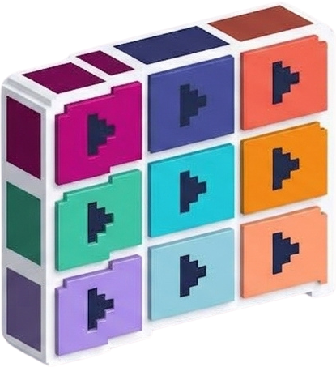
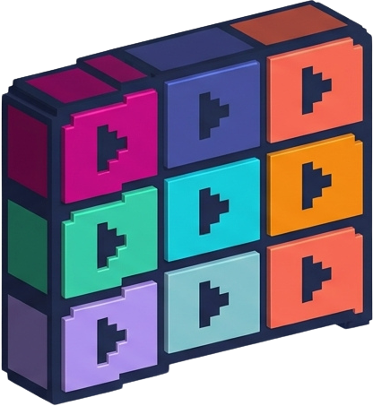

# StreamWall — Documentation technique

> Cette page détaille le fonctionnement, le déploiement et la personnalisation
> de StreamWall. Pour une présentation du projet (aperçu, installation
> rapide), voir le [README](README.md).

Réimplémentation 100 % front-end (HTML / CSS / JavaScript, sans backend) du
projet [bhamrick/multitwitch](https://github.com/bhamrick/multitwitch), qui
permettait à l'origine de regarder plusieurs streams Twitch en simultané sur
une seule page.

Contrairement à l'original (application Python/Pyramid nécessitant un
serveur applicatif), cette version est un **site statique** : elle
fonctionne sur n'importe quel hébergeur de fichiers statiques, sans base de
données ni processus serveur.

## Sommaire

1. [Fonctionnalités](#fonctionnalités)
2. [Structure du projet](#structure-du-projet)
3. [Fonctionnement technique](#fonctionnement-technique)
4. [Lancer le projet en local](#lancer-le-projet-en-local)
5. [Déploiement](#déploiement)
6. [Le paramètre `parent` de Twitch (point critique)](#le-paramètre-parent-de-twitch-point-critique)
7. [Référencement (SEO)](#référencement-seo)
8. [Personnalisation](#personnalisation)
9. [Limitations connues](#limitations-connues)
10. [Licence](#licence)

## Fonctionnalités

- Affichage d'un nombre illimité de streams Twitch côte à côte, dans une
  disposition **calculée dynamiquement** pour occuper **100 % de l'espace
  disponible**, quel que soit le nombre de streams — **sans case vide et
  sans jamais de défilement (scroll)**, même avec un seul stream affiché.
- **Gestion des streams par cases à cocher** : une chaîne ajoutée reste
  connue de l'application. Elle apparaît dans la fenêtre "Changer les
  streams" avec une case à cocher : cochée, elle est affichée dans la
  grille ; décochée, elle est retirée de la grille mais reste dans la
  liste pour être recochée plus tard sans avoir à retaper son nom. Un
  bouton « × » à côté de chaque chaîne permet de l'oublier définitivement.
- **Bouton « + » du menu, toujours affiché** (à gauche de « Réorganiser »,
  que le mode Réorganiser soit actif ou non) : il ouvre la fenêtre
  "Changer les streams", pour ajouter une chaîne ou gérer celles qu'on a déjà.
  **C'est, avec le bouton « Ajouter des streams » de l'état vide (quand aucun
  stream n'est affiché), le seul moyen d'ouvrir cette fenêtre** : il n'y a
  ni bouton "Changer les streams" séparé dans le menu, ni tuile « + » dans
  la zone des lecteurs.
- **Mode "Réorganiser"** (bouton dédié dans le menu) : affiche/masque
  l'en-tête de chaque lecteur (poignée de glisser-déposer, nom de la
  chaîne, boutons ★ et « × » de retrait rapide) et les poignées de
  redimensionnement des tuiles. En dehors de ce mode, seules les vidéos sont
  visibles, pour un visionnage sans distraction. Ce mode ne change ni la
  place ni la taille des tuiles : la zone ne contient que les streams, sans
  tuile d'ajout. C'est dans ce mode, et seulement dans celui-ci, que les
  tuiles se redimensionnent (poignée d'angle) et qu'apparaît le bouton
  **« Réinitialiser la vue »**.
- **Réorganisation par glisser-déposer** (en mode Réorganiser) : on
  attrape n'importe quel point d'un lecteur (pas seulement son en-tête) et
  on le fait glisser sur un autre pour échanger leur position.
  **Alternative clavier** : une fois l'en-tête d'un lecteur focalisé (Tab),
  les **4 flèches** le déplacent dans l'ordre d'affichage — haut/gauche
  pour avancer d'un cran, bas/droite pour reculer d'un cran (la disposition
  n'ayant pas un nombre de colonnes fixe, il n'y a qu'un seul axe de
  réorganisation, pas une notion stable de "case du dessus").
- **Mise en avant de streams** (bouton étoile ☆/★ dans l'en-tête d'un
  lecteur, mode Réorganiser) : jusqu'à **deux streams** peuvent être mis
  en avant simultanément, chacun occupant par défaut **exactement un
  quart** de la zone vidéo, en haut. Un seul mis en avant : il occupe le
  **quart supérieur gauche**, pendant que tous les autres se redisposent
  automatiquement autour (à sa droite, puis en dessous), en remplissant
  toujours 100 % de l'espace. Deux mis en avant : **tous les deux en
  haut**, côte à côte (un quart chacun, la moitié supérieure au total),
  les autres streams remplissant la moitié inférieure — sans jamais
  nécessiter de scroll. Cliquer sur l'étoile d'un stream déjà mis en avant
  l'enlève ; en choisir un troisième au-delà de la limite est ignoré
  (avec un message explicite). C'est le premier stream mis en avant qui
  démarre avec le son. Cette mise en avant n'a d'effet que s'il reste au
  moins un autre stream visible en dehors des streams mis en avant :
  sans "autre" stream avec qui partager l'espace, la disposition utilise
  toute la place normalement. Ces tailles sont celles de DÉPART : elles
  restent ajustables à la main (voir ci-dessous), la mise en avant
  conservant sa place en haut.
- **Redimensionnement manuel de chaque tuile, par ses angles** (mode
  Réorganiser uniquement) : chaque tuile a une petite poignée triangulaire
  dans **chacun de ses quatre angles** ; en **glisser une à la souris ou
  au doigt** agrandit ou réduit la tuile en largeur ET en hauteur d'un
  seul geste, le coin opposé restant fixe. **Toutes les autres tuiles se
  réorganisent alors autour d'elle** en gardant des tailles à peu près
  égales entre elles, selon la place disponible, et **remplissent
  toujours 100 % de l'espace** — pas seulement les voisines, qui
  rétréciraient jusqu'à devenir illisibles. Aucune tuile ne peut d'ailleurs
  descendre sous 120 × 68 px : la tuile qu'on agrandit s'arrête avant. On
  peut redimensionner plusieurs tuiles, y compris **les deux favoris** :
  ils partagent alors un bord, comme de part et d'autre d'un séparateur —
  élargir l'un rétrécit l'autre, le réduire lui rend sa place. Au
  clavier, la poignée qui regarde vers le centre de la tuile se tabule
  (Tab) et les flèches déplacent son coin (Maj pour un pas cinq fois plus
  grand). Le bouton **« Réinitialiser la vue »** remet la taille de tous
  les streams à sa valeur par défaut. Les tailles sont mémorisées dans ce
  navigateur pour chaque combinaison « nombre de favoris + nombre de
  streams » (voir section 15).
- **Bascule thème sombre / clair**, via une icône tout à droite du menu
  (thème sombre par défaut). Le **logo StreamWall** de l'en-tête (l'icône,
  suivie du nom écrit en texte) change avec le thème — une variante de
  l'icône à contour clair pour le sombre, une à contour foncé pour le
  clair — et le site a son **favicon** (voir "Logo et favicon" plus bas).
- Panneau de **chat Twitch** avec sélection de la chaîne à afficher, et
  bouton pour l'afficher/masquer — **masqué par défaut** au premier
  chargement (l'utilisateur choisit de l'ouvrir). Le panneau reste
  **connecté en arrière-plan** quand il est masqué (masquage purement
  visuel) : pas besoin de se reconnecter à chaque affichage. Pour pouvoir **écrire**
  dans les chats (pas seulement les lire), il suffit de se connecter à
  Twitch n'importe où dans ce navigateur — y compris via le lien "Se
  connecter" affiché directement dans le panneau de chat lui-même : aucun
  compte ni jeton n'est géré par StreamWall, le panneau étant une iframe
  Twitch à part entière qui partage automatiquement la session.
- **Validation à l'ajout** : un nom de chaîne vide, contenant des
  caractères invalides, ou de longueur incorrecte est refusé immédiatement
  dans la modale, avec un message explicite — sans attendre l'écran
  d'erreur générique du lecteur Twitch.
- **Auto-complétion à l'ajout** : le champ propose, au fil de la saisie,
  les chaînes déjà connues de ce navigateur qui commencent par ce qui est
  tapé (ex. "ze" propose "zerator" s'il a déjà été ajouté ici). Limité aux
  chaînes déjà utilisées dans ce navigateur, pas au catalogue Twitch
  complet (voir "Limitations connues").
- **Dispositions favorites ("presets")** : la combinaison de streams
  actuellement affichée peut être enregistrée sous un nom, pour être
  rappelée en un clic depuis la modale "Changer les streams", sans avoir
  à recocher chaque chaîne une à une. Elle retient aussi **la disposition
  des tuiles** : l'ordre des streams, ceux qui sont mis en avant et **la
  taille de chaque tuile** ajustée à la main — un clic rétablit tout cela
  (une petite icône de tuiles signale les dispositions qui retiennent des
  tailles ; voir section 13). Sauvegardées en `localStorage`.
  Chaque disposition a aussi son propre **bouton de partage** (icône
  lien) : il copie dans le presse-papiers un lien pointant vers SES
  chaînes à elle, indépendamment de ce qui est affiché à l'instant t —
  pas de bouton "Copier le lien" global dans le menu.
- Menu **« + » / "Réorganiser" / "Afficher-Masquer le chat" / aide « i » /
  langue « EN » / thème / logo GitHub**, positionné en haut à droite de la page (pas de
  bouton "Changer les streams" séparé dans le menu : voir le point sur le
  bouton « + » ci-dessus ; pas de bouton "Copier le lien" non plus : voir le
  point sur les dispositions favorites). Le **logo GitHub**, tout à droite,
  ouvre le dépôt du projet dans un nouvel onglet (voir "Lien GitHub du menu"
  dans la Personnalisation). Sur téléphone, « Afficher/Masquer le chat » se
  réduit à « Chat » pour que tout tienne.
- **Fenêtre d'aide** (bouton **« i »** du menu) : elle explique **toutes les
  options du site, avec des captures d'écran** numérotées et un sommaire
  cliquable — menu, ajout de streams, son, mode Réorganiser, mise en avant,
  redimensionnement, chat, dispositions favorites, thème, clavier et écran
  tactile, données mémorisées. Elle se ferme avec « × », un clic à côté ou la
  touche Échap, et son focus clavier est géré (voir section 16).
- **Site bilingue, français et anglais** : le bouton **« EN » / « FR »** du
  menu change la langue de TOUTE l'interface (menus, messages, fenêtre d'aide et
  ses captures d'écran) sans recharger les lecteurs. Le choix est mémorisé ;
  `?lang=en` dans l'adresse ouvre le site en anglais, et les liens de partage le
  conservent. Le français reste la langue par défaut (voir section 17).
- **Référencement soigné** : titre et description avec les bons mots-clés,
  adresse canonique, aperçus Open Graph / Twitter Card avec une image dédiée,
  données structurées JSON-LD, `robots.txt`, `sitemap.xml`, un `<h1>` unique et
  un accueil avec du vrai texte (voir "Référencement (SEO)").
- Interface reprenant le **code couleur officiel de Twitch.tv** (violet
  `#9147FF` dans les deux thèmes), sans logo ni favicon Twitch.
- Les chaînes actuellement **affichées** sont encodées dans **l'URL**
  (`#chaine1/chaine2/...`), ce qui permet de partager un lien direct vers
  une composition de streams précise.
- La disposition complète (chaînes connues et leur statut, mode
  Réorganiser, thème, langue, visibilité du chat, chaîne de chat sélectionnée,
  dispositions favorites) est sauvegardée en `localStorage` pour être
  restaurée à la prochaine visite.

## Structure du projet

```
streamwall/
├── index.html          Page unique de l'application (structure HTML, balises de référencement, texte de la fenêtre d'aide en français et en anglais)
├── style.css           Feuille de style (thèmes, zone vidéo, poignées, drag&drop, modale, fenêtre d'aide)
├── app.js              Toute la logique applicative, abondamment commentée
├── i18n.js             Langues : dictionnaires français / anglais et moteur de traduction (section 17)
├── robots.txt          Consignes aux robots d'indexation (référencement)
├── sitemap.xml         Plan du site pour les moteurs de recherche
├── assets/
│   ├── logo_mode_sombre.png   Icône du logo pour le thème sombre (contour clair)
│   ├── logo_mode_clair0.png   Icône du logo pour le thème clair (contour foncé)
│   ├── favicon.ico            Favicon (fichier ICO : 16, 32 et 48 px)
│   ├── og-image.jpg           Image d'aperçu pour les réseaux sociaux (1200 x 630)
│   └── help/                  Captures d'écran de la fenêtre d'aide : 9 PNG en français, 9 dans en/ en anglais (section 16)
├── documentation.md    Cette documentation technique (fonctionnement, déploiement, personnalisation)
└── README.md           Présentation du projet (page d'accueil GitHub)
```

Il n'y a **aucune étape de build** (pas de Webpack/Vite/npm install) : les
fichiers sont servis tels quels par n'importe quel serveur HTTP statique.
Le dépôt ne contient aucun outil de développement : rien à installer, ni pour servir
le site ni pour le modifier.

## Fonctionnement technique

### 1. Affichage des streams : le SDK officiel Twitch

Le fichier `index.html` charge le script officiel fourni par Twitch :

```html
<script src="https://embed.twitch.tv/embed/v1.js" defer></script>
```

Ce script expose un objet global `window.Twitch` avec le constructeur
utilisé dans `app.js` pour la vidéo :

- `Twitch.Player` : un lecteur vidéo autonome (utilisé pour chaque stream
  de la grille).

Comme le script est chargé avec l'attribut `defer`, `app.js` attend sa
disponibilité via la fonction utilitaire `whenTwitchReady()` avant de
créer le moindre lecteur.

**Optimisation : une seule scrutation, pas une par lecteur.** Au premier
chargement avec plusieurs streams déjà configurés, `renderPlayersGrid()`
appelle `mountPlayer()` — donc `whenTwitchReady()` — pour chacun d'entre
eux d'un coup, alors que le SDK n'est presque jamais encore prêt à cet
instant. Une implémentation naïve démarrerait un `setInterval` **par
appel**, chacun vérifiant indépendamment exactement la même condition
(`window.Twitch && window.Twitch.Player`) toutes les 50ms — N streams,
N minuteurs redondants. `whenTwitchReady()` mutualise plutôt tous les
callbacks en attente (`pendingTwitchReadyCallbacks`) derrière **une
seule** scrutation partagée, qui les déclenche tous d'un coup dès que le
SDK devient disponible. Elle abandonne aussi au bout de
`TWITCH_READY_MAX_ATTEMPTS` tentatives (~30s) avec un avertissement en
console, pour ne pas scruter indéfiniment si le script ne se charge
jamais (bloqueur de publicité, coupure réseau) — un futur appel (ex.
ajout d'une nouvelle chaîne) relance une scrutation normalement.

Deux `<link rel="preconnect">` dans `<head>` (vers `embed.twitch.tv` et
`www.twitch.tv`) établissent par ailleurs la connexion réseau (DNS +
TLS) vers ces domaines dès le tout début du chargement de la page,
avant même que le SDK ou la première iframe ne l'exigent réellement —
un gain de latence classique pour des domaines systématiquement
utilisés par la page.

> ⚠️ Le SDK `embed/v1.js` **ne fournit pas de constructeur JS pour un
> chat autonome** : il n'existe pas de `Twitch.Chat` dans l'API
> officielle (seuls `Twitch.Player` et `Twitch.Embed`, ce dernier
> combinant vidéo + chat dans une unique iframe, sont exposés). Une
> précédente version de ce projet appelait à tort `new Twitch.Chat(...)`,
> ce qui levait une exception dès la création et empêchait **tout**
> affichage du chat, quelle que soit la chaîne sélectionnée. Voir la
> section [Panneau de chat](#10-panneau-de-chat--iframe-directe-et-non-sdk-js)
> ci-dessous pour la méthode correcte.

### 2. Modèle de données : chaînes connues vs chaînes visibles

Tout l'état des streams repose sur un seul tableau, `state.entries`, où
chaque élément a la forme :

```js
{ name: "zerator", visible: true }
```

- **Ajouter** une chaîne (champ + bouton "Ajouter" de la modale) crée une
  nouvelle entrée avec `visible: true`, ou repasse à `true` une entrée
  existante qui avait été décochée.
- **Cocher / décocher** une case dans la modale (ou cliquer sur le « × »
  d'une carte en mode Réorganiser, qui décoche silencieusement) modifie
  uniquement le champ `visible` de l'entrée correspondante — l'entrée
  elle-même n'est jamais supprimée.
- **Oublier** une chaîne (bouton « × » à côté de son nom dans la modale)
  supprime définitivement son entrée du tableau.

La zone de lecteurs, le sélecteur de chat et le hash de l'URL sont tous
**dérivés** de ce tableau via la fonction `getVisibleChannels()`. Voir
`applyEntriesChange()` dans `app.js`, qui centralise la mise à jour de
toute l'interface après chaque modification.

### 3. Le mode "Réorganiser" et le bouton "+"

Chaque carte de lecteur contient toujours, dans le DOM, un en-tête avec sa
poignée de glisser-déposer, le nom de la chaîne et un groupe d'actions
(`.player-card-actions`) réunissant le bouton "mettre en avant" (☆/★, voir
section 5) et le bouton « × », ainsi qu'un overlay `.player-card-dragzone`
couvrant toute la tuile (voir section 7 ci-dessous pour son rôle). Ces
deux éléments sont positionnés en **overlay absolu par-dessus la vidéo**
(`position: absolute` dans `style.css`) et **masqués par défaut**,
pour une expérience de visionnage sans distraction et sans jamais changer
la taille de la tuile (voir aussi la section sur la disposition dynamique
ci-dessous : les afficher ne doit jamais faire "pousser" la vidéo ni
casser le calcul de mise en page).

Le bouton **"Réorganiser"** du menu bascule un booléen
`state.reorderMode`, qui ajoute/retire la classe CSS `reorder-mode` sur la
zone de lecteurs (`#players-grid`) :

```css
.players-grid.reorder-mode .player-card-header   { display: flex; }
.players-grid.reorder-mode .player-card-dragzone { display: block; }
.players-grid.reorder-mode .player-card-resize   { display: block; }
```

- La première règle affiche l'en-tête de chaque lecteur (et donc la
  poignée de drag et le bouton « × », utilisables uniquement dans ce
  mode).
- La deuxième affiche l'overlay de glisser-déposer par-dessus toute la
  tuile, pour pouvoir démarrer le drag depuis la vidéo elle-même (voir
  section 7).
- La troisième affiche les **poignées de redimensionnement** des tuiles
  (`.player-card-resize`, quatre par tuile, une dans chaque angle : voir
  section 15) : c'est ce qui fait du mode Réorganiser le seul mode où les
  tuiles se redimensionnent. Comme elles recouvrent les angles supérieurs de
  l'en-tête, la règle d'affichage de l'en-tête élargit aussi son padding
  latéral (22 px) pour que le titre et les boutons ★/× restent à l'écart de
  leur zone de saisie.

**Le bouton « + » du menu.** Ajouter et gérer des streams ne dépend pas de
ce mode : le bouton **« + »** (`#btn-add`, dans le menu, à gauche de
"Réorganiser") est **toujours affiché** et ouvre la fenêtre "Changer les
streams" (`openModal()`). C'est, avec le bouton "Ajouter des streams" de
l'état vide (`#btn-empty-add`, quand aucun stream n'est affiché), le seul
point d'entrée vers cette fenêtre : il n'y a pas de bouton "Changer les
streams" séparé dans le menu. Il n'y a **plus de tuile « + »** dans la zone
des lecteurs : elle partageait la place du dernier stream en mode
Réorganiser, ce qui obligeait à activer ce mode pour ajouter un stream et
faisait varier la taille de la dernière tuile selon le mode. La zone ne
contient désormais que les cartes des streams, donc les tuiles ont la même
place et la même taille avec et sans mode Réorganiser (voir section 15), et
remplissent toujours 100 % de la zone. Sans aucun stream, le message d'état
vide ("Aucun stream à afficher", avec son bouton) remplace la zone dans les
DEUX modes (`renderPlayersGrid()`) ; l'état du bouton "Réinitialiser la vue"
y est remis à zéro (inactif).

### 4. Disposition dynamique : 100 % de l'espace, jamais de scroll

C'est le cœur du correctif demandé pour que "les vignettes prennent
toujours le plus de place possible" et qu'"il n'y ait jamais de scroll",
y compris avec un seul stream affiché — et, depuis l'ajout du
redimensionnement manuel (section 15), pour que les tuiles restent
collées les unes aux autres sans jamais laisser le moindre vide, quelles
que soient leurs tailles.

**Le problème avec une grille CSS classique** (`grid-template-columns:
repeat(auto-fit, minmax(420px, 1fr))` avec `aspect-ratio: 16/9` sur les
cartes, utilisé dans une première version) : la largeur des colonnes est
déterminée par la largeur du conteneur, puis la hauteur de chaque carte en
découle via son ratio d'aspect. Rien ne garantit que cette hauteur calculée
tienne dans la hauteur du conteneur — avec un seul stream par exemple, la
carte pouvait être bien plus haute que l'écran, provoquant un défilement.

**Une solution intermédiaire : des pistes `fr` calculées en JS.** Une
version suivante calculait, pour le nombre de tuiles et l'espace réellement
disponible, le nombre de colonnes et de lignes se rapprochant le plus d'un
format 16:9 par tuile (`computeBestGrid()`), puis les appliquait en unités
`fr` (`repeat(cols, 1fr)`) : CSS Grid répartissait alors tout l'espace à
parts égales, sans marge résiduelle sur les côtés de la page. Elle avait
toutefois deux limites :

- **des cases vides** dès que le nombre de tuiles n'est pas un produit
  rond : 5 tuiles donnaient une grille 3×2 avec une case vide, soit
  environ un sixième de l'espace perdu ;
- **aucun redimensionnement individuel possible** : toutes les tuiles
  partageaient les mêmes colonnes et les mêmes lignes, donc élargir une
  tuile élargissait toute sa colonne.

**Une deuxième tentative : un arbre de découpe.** Une version suivante
découpait la zone récursivement en deux, chaque séparateur portant un
ratio, et permettait de déplacer un séparateur entre deux tuiles. Les 100 %
étaient garantis, mais le redimensionnement était trop LOCAL : déplacer un
séparateur ne changeait que les deux tuiles (ou rangées) de part et d'autre.
Agrandir une tuile de la première rangée faisait donc rétrécir SEULES les
autres tuiles de cette rangée — jusqu'à devenir illisibles — pendant que
celles des autres rangées ne bougeaient pas. Et il fallait tirer le côté,
puis le dessous, d'une tuile pour l'agrandir dans les deux sens. D'où le
modèle actuel.

**La solution retenue : un pavage de cellules, résolu par un solveur.** La
zone vidéo est PAVÉE en **cellules** : des rectangles qui se touchent, sans
trou ni chevauchement, et dont la réunion est exactement la zone entière.
Chaque tuile occupe une cellule — elle en est la version réduite d'un
demi-écart (`GRID_GAP / 2`) sur chaque côté qui touche une autre tuile, ce
qui crée l'écart de 4 px entre deux tuiles voisines. Comme les cellules
pavent toute la zone, les tuiles remplissent **TOUJOURS 100 % de l'espace**,
quel que soit leur nombre et quelles que soient leurs tailles : aucune
case vide. Avec 5 tuiles, par exemple, la dernière rangée (2 tuiles) se
répartit simplement sur toute la largeur.

**Emplacements et chaînes.** Les streams visibles occupent des
EMPLACEMENTS numérotés : d'abord les streams mis en avant (dans l'ordre de
`state.featuredChannels`), puis tous les autres dans l'ordre d'affichage.
Le stream n°i s'affiche dans l'emplacement n°i. Réordonner les streams
(section 7) échange donc des emplacements sans toucher aux tailles : elles
appartiennent aux EMPLACEMENTS, pas aux chaînes.

**Épingles et tuiles libres.** Un emplacement est soit ÉPINGLÉ, soit
LIBRE :

```js
{ x0: 0, y0: 0, x1: 0.6, y1: 0.6 }  // une ÉPINGLE : le rectangle voulu, en FRACTIONS de la zone
null                                 // un emplacement LIBRE : le solveur lui donne la place qui reste
```

- une **épingle** dit "cette tuile occupe ce rectangle". Ce sont des
  fractions (jamais des pixels) : elles survivent telles quelles à un
  redimensionnement de la fenêtre ou à l'ouverture du chat. Les streams mis
  en avant sont épinglés par défaut (`getDefaultPins()`, section 5), et tout
  emplacement que l'utilisateur redimensionne à la main le devient à son
  tour (section 15) ;
- un emplacement **libre** n'impose rien : sans mise en avant, tous les
  emplacements sont libres.

**Le solveur : `solveLayout()`.** Il calcule la cellule de chaque
emplacement en découpant récursivement la zone en deux (une "partition
guillotine") :

- **Une coupe passe toujours par le bord d'une épingle**, jamais à
  travers : les épingles sont donc respectées EXACTEMENT, tant qu'il reste
  assez de tuiles libres pour remplir l'espace autour. Les coupes
  candidates sont essayées d'abord à l'horizontale (de haut en bas), puis à
  la verticale — ce qui donne, pour une tuile dans le coin supérieur
  gauche, une région à sa droite puis une région en dessous.
- **Les tuiles libres sont réparties entre les deux côtés d'une coupe** en
  cherchant à ce que leurs surfaces soient les plus proches possible d'un
  côté à l'autre (`allocationOptions()`), en tenant compte du nombre de
  zones libres à remplir de chaque côté (`countFreeRegions()` : une épingle
  au milieu d'une bande laisse une zone à sa gauche ET une à sa droite, il
  faut deux tuiles, pas une). **C'est ce qui fait que, quand on agrandit une
  tuile, TOUTES les autres se réorganisent autour d'elle en gardant une
  taille comparable**, au lieu que seules les voisines rétrécissent.
- **Une région sans épingle** est remplie par une grille régulière
  (`evenGridCells()`) : `computeBestGrid()` (voir plus bas) en choisit le
  nombre de rangées, puis les tuiles sont réparties le plus également
  possible (5 tuiles sur 2 rangées : 3 + 2 ; 7 sur 3 : 3 + 2 + 2), chaque
  rangée occupant toute la largeur.
- **Une marge trop fine pour une tuile** (moins d'une cellule minimale,
  soit environ 124 × 72 px) entre une épingle et le bord de sa région est
  absorbée : l'épingle est "aimantée" au bord (`fitPinnedCell()`), plutôt
  que de laisser une bande inutilisable.
- **Retour en arrière.** Si une répartition des tuiles libres mène à une
  impasse plus bas, le solveur essaie la suivante. Le nombre d'appels est
  borné (`SOLVER_BUDGET`) pour qu'un cas pathologique ne puisse jamais
  figer la page. S'il n'existe vraiment aucune disposition qui respecte
  toutes les épingles, il abandonne les MOINS prioritaires une à une (par
  défaut celles des emplacements de numéro le plus élevé, donc les favoris
  en dernier ; pendant un redimensionnement, la tuile qu'on tire passe en
  premier : voir section 15) plutôt que de laisser un trou.
- **Comparaison de stratégies (dispositions ajustées à la main).** Le solveur
  ne se contente pas de la première disposition qui marche : il en compare
  plusieurs (`LAYOUT_STRATEGIES`) — l'ordre des coupes (horizontales d'abord,
  qui donnent des bandes pleine largeur au-dessus et en dessous d'une tuile,
  ou verticales d'abord, qui donnent des colonnes pleine hauteur) et
  l'absorption des marges fines — et garde celle dont la **plus petite
  vidéo** est la plus grande (`getFreeVideoQuality()`). On mesure la VIDÉO
  et non la surface de la tuile : la vidéo Twitch reste en 16:9 dans sa
  tuile, donc une tuile étroite ou aplatie a beau avoir une surface
  honnête, sa vidéo est minuscule. Sans cette comparaison, agrandir une
  tuile ailleurs qu'au bord laissait à côté d'elle une **lamelle** (par
  exemple 150 × 300 px, dont la vidéo ne fait que 150 × 84) pendant que les
  autres rangées gardaient de grandes tuiles : les rapports entre la plus
  grande et la plus petite surface de vidéo dépassaient couramment 10×. Avec
  la comparaison, la plus petite vidéo ne descend plus sous 220 px de large
  et ce rapport est de 1,7 en médiane, sous 4 dans 9 cas sur 10 (mesuré sur
  des milliers de tuiles agrandies à des positions aléatoires ; il n'était
  que de 1,3 pour une tuile agrandie depuis un coin, et le pire 1 % passe de
  plus de 24× à moins de 7×). Les dispositions par défaut
  (sans redimensionnement manuel) gardent toujours la première stratégie : le
  dessin d'un ou deux favoris ne change pas.

`computeBestGrid()` est conservée, mais uniquement pour CHOISIR le nombre
de rangées d'une grille régulière :

```js
function computeBestGrid(containerWidth, containerHeight, itemCount, gap, aspectRatio) {
  // Pour chaque nombre de colonnes possible (1 à itemCount), calcule le
  // nombre de lignes nécessaires et la taille qu'aurait une tuile 16:9
  // dans la cellule résultante, et retient la disposition (cols, rows)
  // donnant la plus grande tuile SIMULÉE — un bon indicateur de la
  // disposition la plus proche d'une vraie grille vidéo.
}
```

Tant que l'utilisateur n'a rien redimensionné, cette disposition est
recalculée à chaque fois d'après la taille de la zone : elle suit ainsi le
format de la fenêtre (paysage, portrait…).

**Des cellules aux pixels.** `cellToTile()` réduit chaque cellule d'un
demi-écart sur les côtés qui touchent une autre tuile, puis
`applyGridLayout()` applique les rectangles aux cartes en pixels —
`left`/`top`/`width`/`height`, en `position: absolute` dans
`#players-grid` (qui est `position: relative`). On arrondit les BORDS et
non les tailles : comme le demi-écart est un nombre entier de pixels, deux
tuiles voisines restent séparées d'EXACTEMENT 4 px après arrondi, sans
chevauchement ni fente. Si un emplacement n'est pas exactement 16:9, ce
n'est pas la page qui affiche des bandes vides : c'est le lecteur Twitch
**lui-même**, à l'intérieur de sa propre iframe, qui applique un éventuel
lettrboxing — comportement standard de n'importe quel lecteur vidéo
embarqué, et un compromis largement préférable à de l'espace perdu sur
toute l'application.

Ce recalcul est déclenché :

- après chaque ajout/suppression/case cochée-décochée (le nombre de tuiles
  change) ;
- après chaque réorganisation (les chaînes échangent leurs emplacements) ;
- après chaque bascule du mode Réorganiser (les en-têtes et les poignées
  apparaissent ou disparaissent, sans changer la place des tuiles — voir
  section 3) ;
- après chaque bascule du panneau de chat (la largeur disponible change) ;
- après chaque mise en avant/retrait d'un stream (voir section 5 : les
  épingles par défaut changent) ;
- à chaque déplacement du coin d'une tuile en cours de redimensionnement
  (voir section 15) ;
- à chaque redimensionnement, détecté via un **`ResizeObserver`** posé sur
  `#players-grid` (plus fiable qu'un simple écouteur `resize` sur
  `window`, car il détecte aussi les changements de taille internes à la
  page, comme l'apparition du panneau de chat, sans dépendre d'un
  redimensionnement de la fenêtre elle-même).

`#players-grid` reste en `overflow: hidden` de façon définitive : les
cellules pavent exactement la zone disponible, aucun contenu ne devrait
jamais déborder.

**Optimisation : une seule liste de chaînes visibles par rendu.**
`getVisibleChannels()` refiltre `state.entries` à chaque appel. Or un
rendu complet (`renderPlayersGrid()`) a besoin de cette liste à plusieurs
endroits : pour placer les cartes, pour savoir si la mise en avant doit
s'appliquer (`isFeatureSplitActive()`), et pour positionner les tuiles
(`applyGridLayout()`). Plutôt que de laisser chaque fonction rappeler
`getVisibleChannels()` de son côté (jusqu'à 4 refiltrages du même tableau
pour un seul rendu), `isFeatureSplitActive(visibleChannels)` et
`applyGridLayout(visibleChannels)` acceptent toutes deux un paramètre
optionnel : `renderPlayersGrid()` calcule la liste UNE fois et la
propage aux deux. Le paramètre reste optionnel (repli sur
`getVisibleChannels()` si omis) car `applyGridLayout()` est aussi
appelée sans liste sous la main depuis `scheduleGridLayout()`
(redimensionnement, bascule du panneau de chat) — même principe déjà
appliqué à `startsUnmuted` dans `mountPlayer()` (calculé une fois par
`renderPlayersGrid()` et transmis, plutôt que recalculé à l'intérieur).

### 5. Mise en avant de streams (un quart chacun, en haut ; autres autour)

Un clic sur l'étoile (☆/★) de l'en-tête d'un lecteur, en mode
Réorganiser, le "met en avant" : jusqu'à **`MAX_FEATURED_CHANNELS`
(2) streams** peuvent l'être SIMULTANÉMENT, et chacun occupe alors, **par
défaut**, **exactement un quart** de la zone, ancré en haut :

- **un seul stream mis en avant, au moins deux autres streams** : il
  occupe le **quart supérieur gauche**, et tous les autres streams se
  redisposent automatiquement autour de lui (à sa droite, puis en dessous
  sur toute la largeur) ;
- **un seul stream mis en avant, un seul autre stream** : les deux côte à
  côte, le stream mis en avant prenant 60 % de la largeur (voir plus bas
  pourquoi le quart n'y est pas applicable) ;
- **deux streams mis en avant** : ils sont TOUS LES DEUX EN HAUT, côte à
  côte, un quart chacun (ensemble, la moitié supérieure de la zone) : la
  première chaîne mise en avant (`state.featuredChannels[0]`) à gauche, la
  seconde à droite. Les autres streams remplissent alors la moitié
  inférieure.

Ces tailles sont celles de DÉPART : chaque tuile reste redimensionnable à
la main (section 15), sans perdre la mise en avant — les streams mis en
avant sont épinglés par défaut (`getDefaultPins()`), et gardent toujours
les premiers emplacements (section 4), donc leur place en haut.

**Pourquoi pas une simple colonne à 25% ?** Une première version de cette
fonctionnalité réservait 25% de la LARGEUR sur toute la hauteur à la
tuile mise en avant (une colonne de gauche, façon barre latérale). Ça
donnait bien 25% de l'aire, mais pas du tout la disposition demandée :
la tuile occupait tout un côté au lieu d'un unique coin, et les autres
tuiles restaient cantonnées dans les 75% de droite plutôt que d'entourer
la vedette des deux côtés (droite ET dessous). D'où la version actuelle,
en quadrants.

**Cliquer sur une étoile AJOUTE, ne remplace plus.** Contrairement à une
version précédente limitée à un seul stream à la fois (où en choisir un
nouveau remplaçait silencieusement l'ancien), cliquer sur l'étoile d'un
stream qui n'est pas encore mis en avant l'AJOUTE à `state.featuredChannels`
tant que la limite n'est pas atteinte. Au-delà de `MAX_FEATURED_CHANNELS`,
le clic est ignoré et un toast explique qu'il faut d'abord en retirer un
— un remplacement silencieux du premier choix aurait été surprenant
(perdre une mise en avant sans avertissement).

**Un seul conteneur, pas de zones séparées.** `#players-grid` contient
toutes les cartes (y compris les vedettes) — pas de conteneurs séparés.
Une vedette n'a rien de spécial dans le DOM : c'est le calcul de
disposition (`applyGridLayout()`) qui lui donne une épingle par défaut, et
donc sa place en haut.

**Le calcul : `getDefaultPins()` et le solveur.** Les favoris sont épinglés
et occupent les premiers emplacements ; le solveur (section 4) en déduit le
reste :

- **deux favoris** : deux épingles, les deux quarts supérieurs. Le solveur
  coupe à mi-hauteur : la bande du haut est remplie exactement par les deux
  épingles (**exactement 1/4 de la surface chacune**), la moitié inférieure
  reçoit les autres streams, disposés en grille régulière ;
- **un favori et au moins deux autres streams** : une épingle sur le quart
  supérieur gauche (la moitié de la largeur × la moitié de la hauteur,
  **exactement 1/4**). Le "L" qui l'entoure n'est pas un rectangle : le
  solveur le coupe en deux rectangles, entre lesquels les autres streams
  sont répartis pour que leurs surfaces restent comparables, **en
  commençant par celui de droite** :

  ```
  ┌───────────┬───────────┐
  │  favori   │  autres   │  ← à droite du favori : 1/4 de la surface
  │   (1/4)   │ (1re part)│
  ├───────────┴───────────┤
  │        autres         │  ← en dessous : 1/2 de la surface
  │       (2e part)       │
  └───────────────────────┘
  ```

  Le rectangle de droite vaut 1/4 de la surface, celui du dessous 1/2 : ils
  reçoivent donc environ 1/3 et 2/3 des autres streams. Par exemple, 2
  autres streams : 1 + 1 ; 3 autres : 1 + 2 ; 6 autres : 2 + 4 ; 9 autres :
  3 + 6. Chaque rectangle est rempli par une grille régulière ;
- **un favori et un seul autre stream** : le quart supérieur gauche
  laisserait du vide autour de l'unique autre tuile, alors que la zone doit
  être remplie à 100 %. L'épingle du favori prend donc `FEATURED_SOLO_RATIO`
  (60 %) de la largeur sur toute la hauteur, et l'autre stream le reste.

**Plus de cases vides.** L'ancienne grille CSS laissait des cases vides
avec peu d'"autres" streams (une conséquence du découpage en blocs fixes
sur une grille régulière). Ce n'est plus le cas : chaque rectangle est
rempli à 100 %, les tuiles s'étirant au besoin (le lecteur Twitch affichant
alors éventuellement des bandes noires en interne, voir section 4). La
contrepartie est le cas "un favori et un seul autre stream" ci-dessus, où
le quart exact ne peut pas s'appliquer.

**Jusqu'à deux à la fois, et seulement si ça a un sens.**
`state.featuredChannels` mémorise les chaînes mises en avant, dans
l'ordre (tableau vide si aucune). `getActiveFeaturedChannels()` filtre ce
tableau sur les chaînes encore VISIBLES (une chaîne mise en avant puis
décochée n'a plus d'effet tant qu'elle n'est pas revisible, sans avoir
besoin d'être activement retirée de l'état) ; `isFeatureSplitActive()`
détermine ensuite si le découpage en quarts doit réellement s'appliquer :

```js
function isFeatureSplitActive(visibleChannels) {
  const visible = visibleChannels || getVisibleChannels();
  const active = getActiveFeaturedChannels(visible);
  return active.length > 0 && visible.length > active.length;
}
```

La condition `visible.length > active.length` évite un cas dégénéré :
si TOUS les streams affichés sont mis en avant (rien d'"autre" avec quoi
partager l'espace), réserver des quarts n'aurait aucun sens — la disposition
utilise alors toute la surface disponible, comme en l'absence de mise en
avant (aucune épingle : une grille régulière).

**Le son.** Seul le PREMIER stream mis en avant
(`state.featuredChannels[0]`, pas n'importe lequel des deux) démarre
avec le son : avec deux streams mis en avant, laisser le son actif sur
les DEUX serait très perturbant (deux flux audio superposés). Sans mise
en avant, comme avant : le premier stream visible (voir
`renderPlayersGrid()`).

**Interaction avec le glisser-déposer.** Les streams mis en avant
occupent toujours les premiers emplacements, quelle que soit leur position
dans l'ordre d'affichage : réordonner les chaînes par glisser-déposer ou
au clavier (section 7) n'a donc aucune incidence sur eux. Cela échange en
revanche les emplacements des streams NON mis en avant, comme sans mise en
avant ; les tailles, elles, restent celles des emplacements.

### 6. Routage par hash d'URL

Seules les chaînes **visibles** (cochées) sont encodées dans le **hash**
de l'URL (la partie après le `#`), au format :

```
https://votre-domaine.com/#zerator/gotaga/ninja
```

Ce choix (plutôt qu'un chemin d'URL classique) évite toute configuration
de réécriture d'URL côté hébergement : le hash n'est jamais envoyé au
serveur, donc le site fonctionne à l'identique sur un simple hébergement
statique. Voir `readChannelsFromHash()` et `writeChannelsToHash()` dans
`app.js`.

L'adresse peut aussi porter un paramètre de **langue**, `?lang=en`, placé AVANT
le hash (`https://votre-domaine.com/?lang=en#zerator/gotaga`) : il ne concerne
pas les chaînes, et `writeChannelsToHash()` le conserve puisqu'elle ne réécrit
que le hash (section 17).

### 7. Glisser-déposer (drag and drop)

Le réordonnancement utilise l'**API HTML5 Drag and Drop native du
navigateur**, sans dépendance externe (voir `attachDragEvents()` et
`reorderChannels()`). Seul le **nœud DOM** de la carte est déplacé lors
d'un réordonnancement : les lecteurs vidéo ne sont jamais recréés, pour
éviter de recharger les flux. Le nombre de tuiles ne changeant pas, les
TAILLES (les épingles, section 4) ne changent pas non plus : seul
l'emplacement de chaque chaîne est recalculé par `applyGridLayout()`, les
deux chaînes échangeant leurs emplacements.

**Démarrer le drag depuis n'importe quel point de la tuile, pas
seulement l'en-tête.** L'API Drag and Drop natif n'active `dragstart` que
sur l'élément qui porte explicitement `draggable="true"` (ou l'un de ses
enfants directs sans conteneur intermédiaire non-draggable) : au départ,
seul l'en-tête (`.player-card-header`) portait cet attribut, donc on ne
pouvait attraper une carte que par sa fine barre du haut.

Un second problème s'ajoute sur la vidéo elle-même : `.player-card-video`
contient une **iframe** (le lecteur Twitch), c'est-à-dire un tout autre
contexte de navigation, qui capte ses propres évènements souris. Un clic
puis glisser démarré directement sur la vidéo ne remonte donc jamais
jusqu'au document parent, même si on rendait la vidéo elle-même
`draggable`.

La solution retenue est un overlay transparent, `.player-card-dragzone`
(voir `style.css`), positionné en `absolute; inset: 0` par-dessus
toute la tuile — y compris la vidéo — mais **sous** l'en-tête
(`z-index: 1` contre `2`), et **masqué en dehors du mode Réorganiser**
comme l'en-tête. Cet overlay appartient au document principal : il capte
donc normalement les évènements souris sur toute la surface de la tuile.
`createPlayerCard()` (dans `app.js`) pose `draggable = true` à la fois
sur l'en-tête et sur cet overlay, et `attachDragEvents(card, [header,
dragZone])` attache les écouteurs `dragstart`/`dragend` aux deux : le
glisser-déposer peut ainsi démarrer aussi bien depuis la barre
supérieure que depuis n'importe quel point du lecteur. Les évènements de
survol et de dépôt (`dragover`/`dragleave`/`drop`), eux, restent posés
sur la carte entière (`card`), donc inchangés par cet ajout. Les poignées de redimensionnement d'angle
(section 15) sont posées AU-DESSUS de cet overlay (`z-index: 3`, contre 1) :
elles restent attrapables en mode Réorganiser, et un glissement qui en part
ne déclenche jamais un glisser-déposer de la tuile.

**Alternative clavier (accessibilité).** Le glisser-déposer natif n'a pas
d'équivalent clavier standard. `.player-card-header` porte donc
`tabindex="0"` (toujours, pas seulement en mode Réorganiser : l'élément
est de toute façon `display: none` hors de ce mode, donc naturellement
exclu de l'ordre de tabulation par le navigateur) et écoute `keydown` sur
les **4 flèches**, via la table `ARROW_KEY_DIRECTIONS` :

```js
const ARROW_KEY_DIRECTIONS = {
  ArrowUp: -1,
  ArrowLeft: -1,
  ArrowDown: 1,
  ArrowRight: 1,
};
```

Haut et gauche avancent la chaîne d'un cran, bas et droite la reculent
d'un cran, via `moveChannelByKeyboard()`, qui réutilise
`reorderChannels()` avec la chaîne voisine correspondante (donc les
mêmes garde-fous en bout de liste). Toutes les 4 flèches partagent la
même sémantique à un seul axe plutôt que de tenter une navigation
spatiale (haut/bas = ligne, gauche/droite = colonne) : le nombre de
colonnes de la disposition change dynamiquement avec la taille de la fenêtre
(voir section 4), donc "la case du dessus" n'est pas une notion stable
d'un redimensionnement à l'autre — mieux vaut un seul ordre linéaire
prévisible, accessible par n'importe quelle flèche. Le focus reste sur
le même en-tête après le déplacement, pour pouvoir enchaîner plusieurs
flèches sans avoir à re-cliquer.

### 8. Thème sombre / clair

Le thème est piloté par un attribut `data-theme` ("dark" ou "light") posé
sur `<html>`, dont dépendent les variables CSS (`style.css`) :

```css
html[data-theme="light"] {
  --bg-app: #f7f7f8;
  --text-primary: #0e0e10;
  /* ... */
}
```

Pour éviter un "flash" de thème sombre au chargement si l'utilisateur a
choisi le thème clair lors d'une visite précédente, un **petit script
inline** est exécuté en tout début de `<head>` dans `index.html`, avant le
chargement de la feuille de style : il relit la préférence en
`localStorage` et positionne l'attribut `data-theme` immédiatement.
`app.js` (fonction `applyTheme()`) relit ensuite la même valeur pour
garder `state.theme` synchronisé et gérer le clic sur le bouton de bascule
(icône soleil/lune, tout à droite du menu).

L'**icône du logo de l'en-tête** suit le même attribut : deux images sont
dans le DOM et le CSS n'affiche que celle du thème courant (voir "Logo et favicon"
dans la section Personnalisation). Aucun JavaScript n'intervient : comme
`data-theme` est posé avant le premier rendu, la bonne variante du logo
s'affiche d'emblée, sans flash, et `applyTheme()` n'a rien à faire pour lui.

### 9. Persistance

En plus du hash d'URL (qui ne porte que les chaînes visibles), l'état
complet — chaînes connues et leur statut, mode Réorganiser, thème, langue
(clé `streamwall:lang`, écrite par i18n.js : section 17),
visibilité du chat, chaîne de chat sélectionnée, chaînes mises en avant
(section 5), tailles ajustées à la main (section 15) et dispositions
favorites (avec, pour chacune, ses favoris et ses tailles : section 13) — est
sauvegardé dans
`localStorage` (voir `persistState()` et `loadInitialState()`).

### 10. Panneau de chat : iframe directe (et non SDK JS)

Comme la vidéo de chaque stream est déjà affichée séparément via
`Twitch.Player` (voir section 1), le panneau de chat n'a besoin
d'afficher que le chat seul. Twitch documente cela comme un **widget de
chat autonome**, intégré via une simple `<iframe>` dont l'URL suit ce
format (voir https://dev.twitch.tv/docs/embed/chat/) :

```
https://www.twitch.tv/embed/<chaine>/chat?parent=<domaine>[&darkpopout]
```

- `parent` (obligatoire) : même règle que pour `Twitch.Player`, voir la
  section sur le [paramètre `parent`](#le-paramètre-parent-de-twitch-point-critique)
  plus bas — calculé dynamiquement via `getParentDomain()`.
- `darkpopout` (optionnel) : bascule le chat Twitch sur son thème sombre.
  Le code n'ajoute ce paramètre que lorsque `state.theme === "dark"`,
  pour rester visuellement cohérent avec le thème de l'application.

Cette URL est construite par `buildChatEmbedUrl()` dans `app.js`, puis
posée comme `src` d'un élément `<iframe>` inséré dans
`#chat-embed-container` par `renderChatOnly()`, qui est appelée :

- à chaque changement de chaîne sélectionnée dans le menu déroulant du
  chat ;
- à chaque ajout/suppression/case cochée-décochée d'une chaîne (le chat
  peut devoir basculer sur une autre chaîne si celle affichée est
  retirée) ;
- à chaque bascule de thème (pour ajouter/retirer `darkpopout`).

**Le panneau tourne en arrière-plan, même masqué.** Contrairement à une
version précédente, masquer/afficher le panneau de chat (bouton
"Afficher/Masquer le chat") n'appelle PLUS `renderChatOnly()` : c'est
`updateChatPanelVisibility()` qui s'en charge, en ne touchant qu'à
l'attribut `hidden` du panneau (donc à sa seule visibilité CSS, voir
`.chat-panel[hidden]` dans `style.css`). L'iframe déjà montée n'est
jamais détruite pour une simple bascule de visibilité : elle continue de
tourner derrière, connexion Twitch comprise — masquer le chat pour
regarder les vidéos en plein écran, puis le rouvrir, ne force donc
jamais l'utilisateur à se reconnecter ou à recharger le fil de
discussion.

`renderChatOnly()` est en outre **idempotente** : avant de reconstruire
quoi que ce soit, elle compare l'URL cible (`buildChatEmbedUrl()`) au
`src` de l'iframe déjà montée, et ne fait rien si elles sont identiques.
Sans cette vérification, un appel sans rapport avec le chat affiché (ex.
ajouter une chaîne à la grille, ce qui déclenche aussi
`applyEntriesChange()` → `renderChatOnly()`) détruirait et recréerait
l'iframe — donc sa session — pour rien. Elle n'est donc réellement
reconstruite que lorsque la chaîne de chat sélectionnée ou le thème
changent réellement.

**Se connecter pour écrire dans le chat.** Comme l'iframe pointe
directement vers `www.twitch.tv`, avec **ses propres cookies de
session**, totalement indépendants du site qui l'embarque : se connecter
à Twitch n'importe où dans ce même navigateur (via le lien "Se
connecter" affiché directement DANS le panneau de chat par Twitch
lui-même pour un visiteur non identifié, ou sur `twitch.tv` dans un
autre onglet) suffit à connecter automatiquement le chat, sans que
StreamWall n'ait rien à transmettre à cette iframe.

> ⚠️ **Un flux OAuth applicatif (Implicit Grant, etc.) a été
> volontairement écarté ici** : il aurait exigé d'enregistrer une
> application sur https://dev.twitch.tv/console/apps (un `Client-Id`
> propre à ce déploiement, à maintenir) pour, au final, ne RIEN changer à
> l'état de connexion de cette iframe — elle ne sait lire que le cookie
> de session twitch.tv, pas un jeton fourni par la page qui l'embarque.
> Un jeton OAuth applicatif ne serait utile que pour appeler l'API Twitch
> (Helix) **depuis StreamWall lui-même** (afficher un pseudo connecté
> dans son propre menu, chercher des chaînes...), un axe volontairement
> non poursuivi pour l'instant.

### 11. Auto-complétion des chaînes déjà connues

Le champ d'ajout (`#modal-add-input`) est relié à un `<datalist>` HTML
natif (`#modal-known-channels`, attribut `list` sur le champ) : taper
quelques lettres (ex. "ze") propose, dans un menu déroulant natif du
navigateur, les chaînes déjà connues de CE navigateur qui correspondent
— sans code de filtrage à écrire ni de composant de menu déroulant fait
main, le navigateur s'en charge entièrement (filtrage au fil de la
saisie, navigation au clavier, accessibilité).

`renderKnownChannelsDatalist()` (dans `app.js`) reconstruit la liste des
`<option>` à partir de `state.entries` (**toutes** les chaînes déjà
ajoutées un jour dans ce navigateur, visibles ou non — pas seulement
celles actuellement affichées), triées alphabétiquement. Elle est
appelée à chaque changement de cette liste (`applyEntriesChange()`),
à l'ouverture de la modale (`openModal()`), et une fois au chargement de
la page (`init()`) pour refléter immédiatement les chaînes restaurées
depuis `localStorage`.

> ⚠️ **Limite assumée, volontaire** : cette auto-complétion ne propose
> QUE des chaînes déjà tapées/ajoutées par le passé dans ce navigateur —
> pas n'importe quel streamer Twitch existant. Proposer l'intégralité du
> catalogue Twitch demanderait d'interroger son moteur de recherche en
> direct pendant la saisie ; l'API officielle documentée pour ça (Helix,
> endpoint "Search Channels") exige **toujours** un `Client-Id` ET un
> jeton OAuth, sans exception, ce qui imposerait soit un backend pour
> garder un `Client Secret` au chaud (contraire à l'architecture 100 %
> statique de ce projet), soit un vrai flux de connexion Twitch côté
> utilisateur — une portée bien plus large qu'un simple champ
> d'auto-complétion, écartée ici pour cette raison (voir aussi l'encadré
> de la section 10).

### 12. Validation du nom de chaîne à l'ajout

`validateChannelName()` (dans `app.js`) vérifie, **avant** tout appel à
`addChannelEntry()`, que la saisie correspond aux règles Twitch (4 à 25
caractères, lettres/chiffres/underscore uniquement — voir
https://help.twitch.tv/s/article/username-faq) et affiche un message
d'erreur précis sous le champ (`#modal-add-error`) sinon, sans jamais
tenter la création d'un lecteur pour un nom manifestement invalide.

Cette fonction fait volontairement double emploi avec
`sanitizeChannelName()` (section 2) : cette dernière reste utilisée telle
quelle pour les chaînes venant du **hash d'URL**, un contexte sans
retour utilisateur possible où corriger silencieusement (en retirant les
caractères invalides) est le seul choix raisonnable. `validateChannelName()`,
elle, ne corrige jamais silencieusement : elle REFUSE et explique,
puisqu'un humain est en train de regarder le formulaire.

> ⚠️ **Limite assumée** : cette validation ne vérifie que le **format**
> du nom, pas qu'un compte Twitch de ce nom existe réellement. Vérifier
> une existence réelle demanderait d'appeler l'API Helix de Twitch, qui
> exige un `Client-Id` (et un jeton applicatif, donc potentiellement un
> `Client Secret`) — impossible à faire proprement sans backend, ce qui
> contredirait l'architecture 100 % statique de ce projet. Un nom bien
> formé mais inexistant affichera donc toujours l'écran d'erreur standard
> du lecteur Twitch une fois ajouté (voir aussi "Limitations connues").

### 13. Dispositions favorites (presets) et partage

Section dédiée dans la modale "Changer les streams" (sous la liste des
chaînes), qui permet d'enregistrer sous un nom la combinaison de chaînes
**visibles** actuelle **avec la disposition de ses tuiles** — leur ordre, les
streams mis en avant et la taille de chaque tuile ajustée à la main — puis de
la rappeler, ou de la partager, plus tard en un clic. Une disposition est
stockée ainsi (`state.presets`, écrit dans `streamwall:presets`) :

```json
{
  "id": "preset-lx3k9-a1b2c3",
  "name": "Soirée entre amis",
  "channels": ["aaaa", "bbbb", "cccc"],
  "layout": {
    "featured": ["aaaa"],
    "pins": { "0": { "x0": 0, "y0": 0, "x1": 0.6, "y1": 0.6 } }
  }
}
```

- `savePresetFromCurrentState(name)` capture `getVisibleChannels()` (donc
  l'ordre d'affichage courant) **et** `captureCurrentLayout()` : `featured`,
  les streams mis en avant parmi les chaînes visibles, dans l'ordre des
  emplacements ; `pins`, une **copie** des épingles que `manualLayouts`
  mémorise pour la combinaison affichée (`getCurrentLayoutSignature()`, voir
  section 15), au format d'`manualLayouts` (numéro d'emplacement -> rectangle en
  fractions de la zone). `pins` vaut `{}` quand rien n'a été redimensionné :
  c'est la disposition par défaut, et elle est bien enregistrée comme telle.
  Un nom déjà utilisé (comparé sans tenir compte de la casse) **met à jour** le
  preset existant — chaînes, favoris et tailles — plutôt que d'en créer un
  doublon. Le message de confirmation dit ce qui a été retenu en plus des
  chaînes (« … enregistrée, avec les streams mis en avant et la taille des
  tuiles. »).
- **Pourquoi la disposition se retrouve à l'identique.** Les tailles
  appartiennent aux EMPLACEMENTS et non aux chaînes (section 15) ; l'emplacement
  d'une chaîne se déduit de l'ordre des chaînes visibles et de ses favoris
  (les favoris d'abord, dans l'ordre de `state.featuredChannels`, puis les
  autres dans l'ordre d'affichage). Le preset retenant l'ordre des chaînes ET
  les favoris, chaque chaîne retombe sur son emplacement d'origine, donc sur sa
  taille d'origine. Les épingles étant des fractions de la zone, elles
  s'adaptent à une fenêtre d'une autre taille.
- `applyPreset(preset)` rend visibles les chaînes du preset (dans son
  ordre), et repasse invisibles — SANS les oublier — les autres chaînes
  actuellement connues, exactement comme décocher une case dans la liste
  (section 2). Une chaîne du preset qui n'a jamais été ajoutée est créée
  à la volée. Ensuite, si le preset a un `layout`, `applyPresetLayout()`
  rétablit la disposition des tuiles :
  - les **favoris** deviennent exactement ceux du preset (les étoiles
    actuelles sont remplacées, y compris en localStorage) ;
  - les **tailles** de la combinaison obtenue remplacent celles qui y étaient
    mémorisées dans `manualLayouts`, puis sont écrites en localStorage
    (`saveManualLayouts()`). Si le preset avait été enregistré sans
    redimensionnement (`pins` vide), elles sont **effacées** : on retrouve la
    disposition par défaut. Appliquer un preset écrase donc les tailles que
    la combinaison avait avant — comme si on les avait ajustées à la main ;
  - les épingles sont **copiées** (`copyPins()`), à l'enregistrement comme à
    l'application : un redimensionnement modifie les épingles en place, et
    partager le même objet ferait changer le preset en douce. Redimensionner
    APRÈS avoir appliqué un preset ne le modifie donc pas ; pour l'actualiser,
    on l'enregistre à nouveau sous le même nom.
- **Les anciennes dispositions** (enregistrées avant que les tailles ne soient
  retenues) n'ont pas de `layout` : elles ne rétablissent que leurs chaînes,
  et laissent tailles et favoris tels quels, exactement comme avant. Leur
  infobulle le dit, et les enregistrer à nouveau sous le même nom leur fait
  retenir la disposition.
- Dans la liste, la ligne d'une disposition qui retient des tailles ajustées
  à la main porte une petite **icône de tuiles** (`.modal-preset-layout`,
  `hasCustomSizes()`), et l'infobulle du nom annonce ce qu'un clic rétablit.
  Une disposition enregistrée avec la disposition par défaut n'a pas d'icône :
  il n'y a pas de taille particulière à signaler.
- Chaque ligne de la liste a aussi un **bouton de partage** (icône lien,
  `.modal-preset-share`), qui copie dans le presse-papiers un lien
  pointant vers LES CHAÎNES DU PRESET, pas forcément celles affichées à
  l'instant t. `buildPresetShareUrl(channels)` reconstruit l'URL à partir
  de `location.origin` + `location.pathname` + un hash `#chaine1/chaine2/...`
  (même format que `writeChannelsToHash()`, section 6) — **et non** de
  `location.href`, précisément pour ignorer le hash courant et ne
  refléter que les chaînes du preset. **Le lien ne porte que les chaînes** :
  les favoris et les tailles ne voyagent pas (le hash d'URL n'a jamais
  contenu autre chose que la liste des streams). Quand le site est en anglais,
  il porte aussi `?lang=en` (section 17). Il n'y a donc **pas** de
  bouton "Copier le lien" global dans le menu : partager "ce qui est affiché
  maintenant" passe par enregistrer un preset (même éphémère) puis
  cliquer sur son bouton de partage.
- Stockées dans `localStorage` (`STORAGE_KEY_PRESETS`), donc propres à ce
  navigateur — elles ne voyagent pas dans l'URL, à la différence des
  chaînes visibles.
- **Robustesse du stockage.** Au chargement, `sanitizePresets()` écarte les
  entrées inexploitables (ni nom ni liste de chaînes) et, pour les autres,
  retire un `layout` corrompu (`isValidPresetLayout()`) : au plus
  `MAX_FEATURED_CHANNELS` favoris, sans doublon et parmi les chaînes du preset,
  épingles valides (`isValidPin()`, section 15) dont le numéro
  d'emplacement existe. Une disposition dont le `layout` est abîmé reste
  utilisable : elle se comporte alors comme une ancienne, sans jamais planter.

Les noms de presets sont du **texte libre** saisi par l'utilisateur
(contrairement aux noms de chaînes, restreints à `[a-z0-9_]` par
construction) : `renderPresetsList()` ne les insère jamais dans du HTML — le
gabarit ne contient que de la structure fixe, et le nom (comme tous les
libellés, traduits : section 17) est posé par `textContent` / `setAttribute`,
qui n'interprètent jamais de HTML. Aucune injection n'est possible, même avec
des guillemets ou des balises dans le nom.

La modale contient désormais, sous le titre « Dispositions favorites », une
phrase qui explique ce qu'une disposition retient (streams, ordre, mis en
avant, taille des tuiles). Elle est plus haute qu'avant : `.modal` a donc un
`max-height` (la hauteur de l'écran moins 32 px) et **défile** sur un écran de
faible hauteur — un téléphone en paysage, par exemple — au lieu de sortir de
l'écran en rendant « Valider » inatteignable.

### 14. Copier le lien et toast de confirmation

`copyShareLink(url)` (dans `app.js`) copie l'URL reçue en paramètre dans
le presse-papiers via `navigator.clipboard.writeText()`, puis affiche un
toast de confirmation (`showToast()`). C'est une fonction générique — ce
n'est qu'un appelant, le bouton de partage de chaque preset (voir section
13), qui décide QUELLE url partager.

`navigator.clipboard` exige un **contexte sécurisé** (HTTPS, ou
`http://localhost`/`http://127.0.0.1` en développement) et peut être
absent sur d'anciens navigateurs : `copyShareLink()` retombe alors sur
`fallbackCopyToClipboard()`, qui utilise la technique classique
(`<textarea>` temporaire hors écran + `document.execCommand("copy")`,
dépréciée mais encore largement supportée en repli).

Le toast lui-même (`#toast` dans `index.html`) est un simple message
temporaire positionné en bas à droite : `showToast()` force un reflow
(`void el.toast.offsetWidth`) entre le retrait de l'attribut `hidden` et
l'ajout de la classe `is-visible` qui déclenche la transition CSS —
nécessaire car, sans ce reflow forcé, le navigateur peut fusionner les
deux changements de style dans un seul repaint et sauter l'animation
d'entrée si le toast était démasqué juste avant dans le même tick.

### 15. Redimensionnement manuel des tuiles (mode Réorganiser)

En mode Réorganiser — et **seulement** dans ce mode — chaque tuile peut
être redimensionnée à la main en tirant un de ses coins. Toutes les autres
tuiles se réorganisent alors autour d'elle en gardant des tailles à peu
près égales, et continuent de remplir 100 % de l'espace disponible.

**Pourquoi seulement en mode Réorganiser.** Hors de ce mode, seules les
vidéos sont visibles (visionnage sans distraction) : une poignée dans un
angle recouvrirait en plus les commandes du lecteur Twitch (le plein écran
est dans l'angle inférieur droit). Le mode Réorganiser est celui où l'on
arrange l'écran (en-têtes, glisser-déposer) ; son overlay de
glisser-déposer recouvre de toute façon déjà la vidéo. La règle est
appliquée deux fois : la poignée est `display: none` en CSS hors de ce
mode, ET `onGripPointerDown()`/`onGripKeyDown()` sortent immédiatement si
`state.reorderMode` est faux (un glissement ou une touche ne peut donc rien
redimensionner, même par un autre chemin). Le bouton « Réinitialiser la
vue » n'existe lui aussi que dans ce mode.

**Les poignées d'angle.** Chaque carte contient QUATRE poignées, une dans
chacun de ses angles : des `<div class="player-card-resize" role="button"
data-corner="…">` créés par `createPlayerCard()`, chacun un petit triangle.
`data-corner` dit quel coin la poignée tire : `tl` (haut gauche), `tr` (haut
droit), `bl` (bas gauche) ou `br` (bas droit). Tirer une poignée déplace
SON coin, le coin OPPOSÉ reste fixe : la tuile s'agrandit ou se réduit en
largeur ET en hauteur d'un seul geste (l'ancien modèle obligeait à tirer le
côté puis le dessous). Le CSS déduit de `data-corner` la position du
triangle et le curseur (`nwse-resize` pour `tl`/`br`, `nesw-resize` pour
`tr`/`bl`).

**Tous les angles, y compris ceux de la zone.** Une tuile ne peut pas sortir
de la zone : tirer VERS L'EXTÉRIEUR un angle qui touche déjà le bord ne
change rien (le coin tiré est borné à la zone). Tirer ce même angle vers
l'INTÉRIEUR réduit en revanche la tuile par ce coin, l'espace libéré étant
repris par les autres tuiles. Pour AGRANDIR une tuile, on tire donc un angle
qui n'est pas contre le bord, vers l'extérieur de la tuile — par exemple
l'angle bas droit d'une tuile en haut à gauche, ou l'angle haut gauche d'une
tuile en bas à droite. Une tuile du milieu s'agrandit dans n'importe quelle
direction, par n'importe lequel de ses quatre angles.

**Ce qui se passe quand on tire.** La tuile devient **épinglée** sur le
rectangle voulu (en fractions de la zone), et le solveur (section 4)
réorganise toutes les autres tuiles libres autour d'elle. Exemple avec 5
tuiles sur une zone de 1592 × 836 px, en agrandissant la première à 60 % ×
60 % :

```
avant  : 531×418  531×418  531×418  796×418  796×418   (rangées 3 + 2)
après  : 953×500  635×249  635×247  794×332  794×332   (la 1re tuile agrandie ; les 4 autres
                                                         se répartissent autour, à surfaces
                                                         comparables)
```

Toutes les autres tuiles ont bougé et s'adaptent — pas seulement celles de
la première rangée.

**Plusieurs tuiles redimensionnées : les tuiles épinglées s'adaptent, elles
ne bloquent pas.** Quand on redimensionne une tuile, les AUTRES tuiles déjà
épinglées (un favori, ou une tuile redimensionnée plus tôt) ne sont pas des
obstacles infranchissables : `getTrialPins()` les adapte, dans cet ordre.

1. **Un bord partagé bouge pour les deux tuiles.** Si une tuile épinglée
   COLLE un bord de la tuile qu'on tire — elle le touche, et tout son côté en
   regard est contenu dans celui de la tuile (`glueNeighbor()`) — ce bord
   suit. C'est ce qui rend possible le cas de **deux favoris**, qui
   occupent ensemble toute la largeur de la bande du haut : les élargir
   l'un sans toucher l'autre est impossible, donc élargir l'un rétrécit
   l'autre du même côté (son bord opposé reste fixe), comme de part et
   d'autre d'un séparateur. Dans l'autre sens, réduire le premier **rend la
   place au second** au lieu de laisser un trou ou d'y glisser une autre
   tuile. Le voisin est repéré d'après sa cellule affichée, mais seul CE bord
   de son épingle change : les trois autres restent ceux qu'il avait (sa
   cellule affichée peut avoir été étirée par le solveur tant que la bande
   qui le sépare de la tuile est trop fine pour une tuile ; l'enregistrer
   figerait cet étirement, qui s'accumulerait au fil du geste).
2. **Ce qui est recouvert cède la place.** Une tuile épinglée que la tuile
   recouvrirait quand même — elle n'est pas voisine, ou son côté en regard
   dépasse celui de la tuile — est POUSSÉE : réduite à sa plus grande partie
   rectangulaire qui ne touche pas la tuile (`largestRectAvoiding()`).

Dans les deux cas, une tuile ainsi adaptée garde au moins une cellule
minimale ; sinon la disposition est refusée, et c'est la tuile qu'on tire
qui s'arrête (voir plus bas), pas les autres qui disparaissent. Les épingles
qui n'ont pas à bouger ne sont pas réécrites. (Une version antérieure
traitait au contraire toute tuile épinglée comme un obstacle : avec deux
favoris, qui remplissent toute la largeur, aucun des deux ne pouvait être
élargi, et un tirage en diagonale n'avançait pas du tout.)

**Une taille minimale garantie, pour que rien ne devienne illisible.**
`isValidSlotCell()` refuse toute disposition qui :

- oblige une autre tuile épinglée à descendre sous la taille minimale pour
  s'adapter (voir ci-dessus) ;
- oblige le solveur à abandonner l'épingle de la tuile qu'on tire (les
  épingles plus anciennes, elles, cèdent : voir plus bas) ;
- réduirait une tuile en dessous de `MIN_TILE_WIDTH` × `MIN_TILE_HEIGHT`
  (120 × 68 px) — sauf si la disposition de départ était déjà en dessous
  (beaucoup de streams sur un petit écran) : on n'empire alors pas la
  situation.

Quand le pointeur va plus loin que ce qui est permis, `resizeSlotTo()`
cherche par **dichotomie** la plus grande taille valable sur le chemin (dix
itérations sur l'interpolation des bords) : la tuile s'arrête au dernier
point possible, même si le pointeur a sauté bien au-delà, au lieu de
bloquer net.

**Aimantation aux bords.** `getCellForCorner()` "aimante" le coin tiré au
bord de la zone dès qu'il en est à moins de `RESIZE_SNAP_DISTANCE` (14 px),
pour atteindre facilement toute la largeur ou toute la hauteur ; il est
aussi gardé à au moins une cellule minimale du coin fixe.

**Pas de lamelles : les marges fines sont avalées.** Quand une tuile
redimensionnée laisserait entre elle et le bord de sa région une marge qui ne
donnerait à une tuile libre qu'une vidéo étroite (moins de 170 ou 220 px de
large selon le niveau : `getSnapForVideoWidth()`), le solveur compare, entre
autres, le cas où la tuile **avale** cette marge (elle s'étire jusqu'au bord)
et le cas où une tuile libre s'y loge, et garde celui qui donne les
plus grandes vidéos (voir section 4). Concrètement, c'est un "aimant" : une
tuile qu'on agrandit vers un bord s'y colle dès qu'elle en est à quelques
centaines de pixels au plus, plutôt que de laisser une tuile réduite à une
bande. Le seuil est volontairement modeste (au plus 14 % de la zone) : plus
fort, il donnerait l'impression qu'un glissement ne fait rien.

**La tuile qu'on tire est prioritaire ; les anciennes épingles cèdent.** Quand
plusieurs tuiles ont été redimensionnées, il arrive que leurs épingles ne
puissent plus toutes être respectées ensemble (elles forment par exemple un
"moulinet" qu'aucune coupe ne sépare). Une version antérieure abandonnait
alors les épingles par numéro d'emplacement décroissant — souvent celle de la
tuile qu'on venait de tirer — et refusait le geste : c'était le "blocage au
bout d'un moment". Désormais `solveLayout()` reçoit une **priorité** (la tuile
qu'on tire en tête) et `isValidSlotCell()` n'exige que le respect de CETTE
épingle : ce sont les plus anciennes qui cèdent, et `resizeSlotTo()` les
oublie (elles redeviennent des tuiles libres qui se réorganisent) au lieu de
bloquer l'action en cours. De même, une épingle que le solveur n'a pas pu
respecter à l'affichage (`keptSlots`) n'est plus qu'un fantôme : elle ne
compte plus dans les calculs suivants, sinon elle ferait croire qu'une tuile
est recouverte et bloquerait tout nouveau glissement, même d'un pixel. Il
reste des butées légitimes : une tuile ne peut pas s'agrandir vers un voisin
qui a déjà atteint sa taille minimale, ni au point de réduire une autre
tuile sous 120 × 68 px.

**Le geste : évènements du pointeur.** `onGripPointerDown()`,
`onGripPointerMove()` et `endGripDrag()` s'appuient sur les **Pointer
Events**, qui couvrent d'un seul jeu de gestionnaires la souris, le doigt et
le stylet (`touch-action: none` sur la poignée empêche le navigateur
tactile de prendre le geste pour un défilement). Les gestionnaires sont
posés une fois sur `#players-grid` (délégation), pas sur chaque poignée.
Points techniques importants :

- **La capture du pointeur** (`setPointerCapture()`). Chaque tuile contient
  une **iframe** Twitch, un autre contexte de navigation qui avale les
  évènements souris dès que le curseur la survole : sans précaution, le
  glissement se figerait dès que le curseur passerait au-dessus d'une
  vidéo. La capture redirige tous les évènements suivants vers la poignée,
  où qu'aille le curseur. En complément, `#players-grid` reçoit pendant le
  geste la classe `is-resizing`, qui désactive les évènements sur les vidéos
  et sur la zone de glisser-déposer et impose le curseur de
  redimensionnement partout (`style.css`).
- **Pas de saut sous le curseur.** À la saisie, on mémorise l'écart entre le
  pointeur et le coin de la tuile ; ensuite le coin suit le pointeur avec
  cet écart, il ne "saute" pas pour se centrer dessus.
- **Recalcul immédiat.** Chaque déplacement rappelle `applyGridLayout()`
  (plutôt que `scheduleGridLayout()`) : `currentLayout`, donc la base du
  déplacement suivant, reste toujours cohérent avec ce qui est affiché. Le
  coût est négligeable (quelques dizaines de tuiles au plus).
- **Écriture en fin de geste seulement** : `saveManualLayouts()` n'est
  appelé qu'au relâchement, pas à chaque déplacement.

**Accessibilité : au clavier.** Les poignées sont des `<div role="button">`
avec un `aria-label` ("Redimensionner <chaîne> par son coin bas droit :
glisser, ou flèches du clavier"). Pour ne pas multiplier les arrêts de
tabulation (quatre par tuile, soit une trentaine avec huit streams), **une
seule poignée par tuile est dans l'ordre de tabulation** (`tabindex="0"`) :
celle de l'angle qui regarde vers le CENTRE de la zone, choisie par
`getKeyboardGripCorner()` (`br` pour une tuile de la moitié supérieure
gauche, `bl` pour la supérieure droite, `tr` pour l'inférieure gauche, `tl`
pour l'inférieure droite) — l'angle vers lequel la tuile peut réellement
grandir. Les trois autres ont `tabindex="-1"` : elles restent pleinement
utilisables à la souris et au doigt (et au clavier si elles reçoivent le
focus par programme). Focalisée, la poignée réagit aux 4 flèches, qui
déplacent SON coin dans leur direction (droite = le coin va vers la droite)
de `RESIZE_KEYBOARD_STEP` (2 %) de la zone, 10 % avec Maj, avec les mêmes
garde-fous que la souris. C'est l'équivalent, pour le redimensionnement, de
l'alternative clavier du glisser-déposer (section 7).

**Le bouton « Réinitialiser la vue ».** `#btn-reset-layout` (dans le menu)
n'apparaît qu'en mode Réorganiser, et n'est actif que lorsque la
disposition affichée a été modifiée à la main (rien à réinitialiser
sinon). `resetManualLayout()` oublie les épingles de la combinaison
affichée et revient à la disposition par défaut, favoris compris (le quart
supérieur gauche, etc.). Les dispositions mémorisées pour d'AUTRES
combinaisons ne sont pas touchées.

**Disposition par défaut ou manuelle.** Tant que rien n'a été
redimensionné, les épingles sont celles par défaut, reconstruites à chaque
calcul. Au premier redimensionnement effectif, `freezeCurrentLayout()`
FIGE les épingles en vigueur (par défaut comprises : celles des favoris) :
ce sont elles, et elles seules, qui sont mémorisées et réutilisées ensuite.
On ne fige qu'au premier changement réel — un simple clic sur la poignée,
sans déplacement, ne fige donc rien.

**Mémorisation : une disposition par combinaison.** Les dispositions figées
sont conservées dans `manualLayouts` et écrites en `localStorage` (clé
`streamwall:layouts`). La clé de chacune est une **signature**
`"<favoris>:<emplacements>"` (`getLayoutSignature()`) : le nombre de
streams mis en avant actifs et le nombre de streams visibles. Exemples :
`0:5` (5 streams, aucun favori), `1:7` (7 streams dont 1 mis en avant). La
valeur est l'ensemble des épingles, par numéro d'emplacement :

```json
{ "0:5": { "0": { "x0": 0, "y0": 0, "x1": 0.6, "y1": 0.6 } } }
```

Deux configurations qui partagent ces deux nombres ont exactement les mêmes
emplacements possibles, donc les mêmes tailles s'y appliquent — quelles que
soient les chaînes concernées, puisque les tailles appartiennent aux
emplacements. Conséquences :

- ajouter ou retirer un stream, ou changer le nombre de favoris, change de
  combinaison : la disposition par défaut de la nouvelle combinaison
  s'applique, **sans effacer** celle de l'ancienne — elle est retrouvée si
  on revient à cette combinaison plus tard ;
- réordonner les streams, ouvrir le chat, redimensionner la fenêtre ou
  basculer le mode Réorganiser ne changent pas de combinaison : les
  tailles sont conservées (les épingles sont des fractions, voir section 4) ;
- au plus `MAX_STORED_LAYOUTS` (20) dispositions sont conservées, les plus
  anciennes étant évincées.

**Enregistrer des tailles avec des streams précis : les dispositions
favorites.** Comme une taille appartient à une COMBINAISON (nombre de streams
et de favoris) et non à des chaînes, retrouver un réglage précis avec des
streams précis passe par une disposition favorite (section 13) : à
l'enregistrement elle copie les épingles de la combinaison affichée
(`captureCurrentLayout()`), à l'application elle les réécrit dans
`manualLayouts` sous la signature de ses streams (`applyPresetLayout()`) —
en remplaçant celles qui y étaient — et rétablit aussi ses favoris.

**Robustesse du stockage.** Au chargement, `loadManualLayouts()` valide
chaque entrée : signature bien formée, chaque épingle valide
(`isValidPin()` : quatre fractions finies, dans la zone, formant un
rectangle non vide), numéros d'emplacement cohérents avec la signature. Toute
entrée invalide — y compris l'ancien format à base d'arbre de découpe d'une
version précédente — est ignorée et on retombe sur la disposition par
défaut, sans jamais planter.

**Le mode Réorganiser ne change pas la disposition.** La zone ne contient
que les tuiles des streams : le bouton « + » qui ajoute un stream est dans le
menu (section 3), pas dans la zone, et aucune tuile d'ajout ne cède de place
ni n'occupe d'emplacement. Les tailles ajustées à la main — comme la
disposition par défaut — sont donc rigoureusement identiques avec et sans le
mode Réorganiser, et les tuiles remplissent 100 % de la zone dans les deux
cas.

### 16. Fenêtre d'aide (bouton « i »)

Le bouton **« i »** du menu (`#btn-help`, à gauche du bouton de langue)
ouvre une fenêtre qui explique **toutes les options du site, avec des
captures d'écran** : le menu, l'ajout de streams, le son, le mode
Réorganiser, la mise en avant, le redimensionnement par les coins, le chat,
les dispositions favorites, le thème, le clavier et l'écran tactile, et enfin
ce qui est mémorisé. Un sommaire à gauche permet d'aller directement à une
rubrique ; sur un écran étroit (≤ 720 px), il passe au-dessus du texte sous
forme d'une rangée de boutons qui défile horizontalement.

**Un contenu 100 % statique, en deux versions.** Le texte et les captures sont
du HTML écrit directement dans `index.html` (bloc `#help-overlay`) : aucun texte
n'est construit en JavaScript, aucune donnée n'est chargée ni calculée à
l'ouverture, et la fenêtre reste donc un simple fichier à éditer (voir
"Modifier la fenêtre d'aide" dans la section Personnalisation). Comme elle est
longue, elle n'est pas dans le dictionnaire de traduction (section 17) : chaque
rubrique (`<div class="help-section">`) contient **deux blocs**,
`<section class="help-lang" lang="fr">` et `lang="en"`, avec leurs propres
titres (`help-xxx-title` et `help-xxx-title-en`) et leurs propres captures
(`assets/help/` et `assets/help/en/`). Le CSS n'en affiche qu'un, celui de la
langue de la page (`html[lang="fr"] .help-lang[lang="fr"]`…) : l'autre est en
`display: none`, donc ignoré des lecteurs d'écran, et ses images
`loading="lazy"` ne sont jamais téléchargées. Le titre de la fenêtre, le
sommaire et les libellés passent, eux, par le dictionnaire (`data-i18n`).
Les rubriques et leurs identifiants (`help-intro`, `help-menu`…) sont
communs aux deux langues, donc le sommaire, le défilement et la rubrique
courante fonctionnent à l'identique. Elle
réutilise l'habillage de la modale "Changer les streams" (`.modal-overlay` et
`.modal`), en plus large (`.help-modal`, 980 px au plus) ; toutes ses
couleurs sont les variables de thème, donc elle suit le thème sombre/clair.
Les deux fenêtres sont indépendantes : chacune recouvre toute la page, une
seule peut donc être atteinte à la fois. Échap ferme l'une comme l'autre
(`onModalKeyDown()` pour la modale des streams).

**Le JavaScript ne gère que le confort d'une boîte de dialogue** (section
« Fenêtre d'aide » d'`app.js`) :

- `openHelp()` / `closeHelp()` affichent et masquent la fenêtre (attribut
  `hidden`, comme la modale des streams) ; on la ferme avec le bouton « × »,
  un clic sur le fond assombri, ou la touche **Échap** (`onHelpKeyDown()`).
  À l'ouverture, le contenu repart toujours du haut.
- **Focus clavier.** À l'ouverture, le focus va sur la boîte
  (`#help-dialog`, `role="dialog"`, `aria-modal="true"`,
  `aria-labelledby="help-title"`) : un lecteur d'écran annonce son titre, et le
  premier Tab tombe sur le bouton « × ». Tab et Maj+Tab **bouclent** à
  l'intérieur de la fenêtre (piège à focus : `aria-modal` seul n'empêche pas
  tous les navigateurs de tabuler dans la page cachée derrière), et à la
  fermeture le focus est **rendu** à l'élément qui l'avait avant l'ouverture
  (le bouton « i »). La zone de lecture (`#help-body`, `tabindex="0"`) se fait
  défiler aux flèches du clavier.
- **Sommaire par boutons, pas par liens.** Les rubriques (`.help-toc-link`) et
  les renvois du texte (`.help-link`, par exemple « voir Mettre en avant »)
  sont des `<button data-help-target="<id de la section>">`, traités par un
  seul écouteur (délégation) qui appelle `scrollToHelpSection()`
  (`scrollIntoView()` puis focus sur la section). Ce ne sont volontairement
  **pas des liens `#ancre`** : le hash de l'adresse contient la liste des
  streams (section 6), et un lien `#help-add` l'écraserait — les streams
  affichés changeraient. Aucun `<a href>` n'existe dans la fenêtre.
- **Rubrique courante.** Pendant le défilement, `updateHelpToc()` marque
  (`aria-current="true"`) la rubrique de la dernière section dont le haut a
  atteint le haut de la zone de lecture, à `HELP_TOC_OFFSET` (40 px) près ;
  tout en bas, c'est la dernière section (les dernières sont trop courtes
  pour jamais atteindre le haut). Le recalcul est limité à une fois par image
  affichée (`scheduleHelpTocUpdate()`, `requestAnimationFrame`) puisque
  l'évènement `scroll` part très souvent. Le défilement du sommaire est
  animé (`scroll-behavior: smooth`), sauf pour qui a demandé moins
  d'animations (`prefers-reduced-motion`).

**Les captures d'écran.** Il y en a **deux jeux de neuf** : les françaises dans
`assets/help/`, les anglaises (mêmes noms) dans `assets/help/en/`, avec des
`` : la fenêtre étant masquée tant qu'elle n'est pas
ouverte, **aucune capture n'est téléchargée avant que l'utilisateur ne fasse
défiler l'aide jusque-là**, et seul le jeu de la langue affichée l'est (elles
pèsent de 28 à 290 Ko chacune, environ 1,7 Mo par langue). Les attributs
`width`/`height` de chaque `` sont les dimensions réelles du fichier :
ils réservent la place, pour que le texte ne "saute" pas quand une capture
arrive, et pour que les sauts du sommaire tombent au bon endroit.

| Fichier | Ce qu'il montre | Pastilles |
| --- | --- | --- |
| `help-header.png` | le menu du haut : « + », Réorganiser, chat, aide, langue, thème, logo GitHub (2× pour rester net) | 7 |
| `help-add-streams.png` | le haut de la fenêtre "Changer les streams" : saisie, liste (2×) | 3 |
| `help-wall.png` | le mur de streams, sans rien d'autre | — |
| `help-reorder.png` | le mode Réorganiser : barre d'outils et poignées des tuiles | 4 |
| `help-favorites.png` | deux streams mis en avant | 2 |
| `help-resize.png` | un stream agrandi par un coin, les autres réorganisés | 3 |
| `help-chat.png` | le panneau de chat ouvert | 3 |
| `help-presets.png` | le bas de la fenêtre "Changer les streams" : enregistrement, nom, icône des tailles mémorisées, partage (2×) | 4 |
| `help-light-theme.png` | le thème clair | 2 |

Les **pastilles violettes numérotées** dessinées sur les captures
correspondent à la **légende numérotée** juste dessous (`<ol class="help-legend">`) :
le numéro de chaque ligne est une pastille CSS identique, alimentée par un
compteur CSS (l'ordre des `<li>` fait foi, aucun numéro n'est écrit à la main).
Si vous ajoutez ou retirez une pastille sur une capture, la légende doit
suivre.

**Comment les captures ont été réalisées.** Ce sont des images FIXES : elles
ne se mettent pas à jour toutes seules. Chacune a été prise sur le VRAI site,
ouvert dans un Chrome sans fenêtre et mis dans l'état à illustrer en
remplissant le `localStorage` (mêmes clés que l'application : chaînes,
favoris, mode Réorganiser, tailles ajustées, thème, chat, dispositions), puis
annotée de ses pastilles numérotées. Deux choses sont simulées, faute de
pouvoir (ni vouloir) charger Twitch : les **lecteurs vidéo** sont remplacés par
des images factices (dégradé, "EN DIRECT", nom de chaîne fictif :
`exemple_un`, `exemple_deux`…) — on ne montre donc aucun vrai streamer — et le
**chat** par quelques messages fictifs. Le réseau externe était bloqué pendant
la prise de vue. Les captures anglaises sont prises de la même façon avec la
langue anglaise mémorisée (`streamwall:lang` = `en`), et des libellés adaptés :
"LIVE", `example_one`, `example_two`…, messages de chat en anglais, disposition
« Friends night ».

Le script qui automatisait tout cela (`tools/generate-help-screenshots.js`,
fondé sur `puppeteer-core`) **n'est plus dans le dépôt** : le site est resté
sans aucun outil de développement. Il reste récupérable dans l'historique git
(`git show 4350241^:tools/generate-help-screenshots.js`) pour refaire les
captures après un changement d'interface — à adapter, il ne connaît pas
forcément les derniers éléments de l'interface ; sinon, on les prend à la main,
dans les mêmes états et avec les mêmes noms de chaînes fictifs. Dans les deux
cas, si la taille d'une capture change, mettez à jour les attributs
`width`/`height` de son `` dans `index.html`.

**Le menu sur téléphone.** Avec le bouton « + », le bouton « i », le bouton de
langue et le lien GitHub, le menu compte sept éléments (six boutons — +,
Réorganiser, chat, aide, langue, thème — et le lien) ; pour qu'ils tiennent tous
sur un écran de 360 px sans faire défiler le menu, le menu devient **compact**
jusqu'à 600 px de large : le libellé « Afficher/Masquer le chat » se réduit à
**« Chat »** (`.menu-btn-extra`, une partie du libellé masquée en CSS ;
`aria-label` garde le nom complet pour les lecteurs d'écran ; en anglais,
« Show/Hide chat » se réduit de même), l'écart entre deux éléments passe de 8 à
3 px, les boutons d'icône de 36 à 32 px (largement au-dessus des 24 px minimum
recommandés pour une cible tactile) et les boutons à texte sont plus serrés.
Sous 520 px, le nom « StreamWall » est en plus masqué et l'en-tête resserré.
Au-delà de 600 px, rien ne change.

### 17. Langues (français / anglais)

Le site existe en **français** (langue par défaut) et en **anglais**. Le
bouton de langue du menu (`#btn-lang`, entre l'aide « i » et la bascule de
thème) montre **l'autre** langue — « EN » quand le site est en français, « FR »
quand il est en anglais — et la bascule au clic. Rien n'est rechargé : les
lecteurs vidéo et le chat gardent leur session. Tout passe par **`i18n.js`**
(dictionnaires et moteur de traduction, sans dépendance), chargé dans `<head>`
avant le CSS et `app.js`, et exposé par `window.StreamWallI18n`.

**Comment la langue est choisie**, par ordre de priorité
(`resolveInitialLanguage()`) :

1. le paramètre d'adresse **`?lang=en`** (ou `?lang=fr`) : un lien partagé
   s'ouvre dans la langue de celui qui l'a partagé (`readLanguageFromUrl()`) ;
2. le **choix mémorisé** par le bouton de langue, en `localStorage`, clé
   `streamwall:lang` (`readStoredLanguage()`) ;
3. sinon le **français**. La langue du navigateur n'est PAS consultée, sauf si la
   constante `AUTO_DETECT_BROWSER_LANGUAGE` est passée à `true` : elle est
   désactivée volontairement, car les robots d'indexation se présentent en
   anglais et verraient donc la version anglaise à la place de la française sur
   l'adresse principale (voir "Référencement (SEO)"). Un visiteur anglophone
   utilise le bouton « EN ».

Une valeur inconnue (`?lang=de`, choix mémorisé corrompu) est ignorée. Un clic
sur le bouton (`setLanguage()`) pose `<html lang>`, traduit la page, mémorise le
choix et met à jour l'adresse (`syncUrlParameter()`) : `?lang=en` pour
l'anglais, rien pour le français ; le chemin et le **hash** (la liste des
streams) sont conservés, et `writeChannelsToHash()` ne perd jamais le
paramètre (son `replaceState` ne réécrit que le hash).

**Trois façons d'avoir un texte dans une langue :**

- **Texte statique** (`index.html`) : un attribut **`data-i18n="clé"`** remplace
  le texte de l'élément, **`data-i18n-attr="aria-label:clé;title:clé2"`**
  remplace des attributs (`aria-label`, `title`, `placeholder`, et même le
  `content` des balises `<meta>` et le `<title>`). Le HTML contient déjà le
  texte **français** : c'est ce que voient les robots et les navigateurs sans
  JavaScript, et le français ne demande aucun travail au chargement (aucun
  clignotement). Le dictionnaire français doit donc rester IDENTIQUE à ce texte
  (`applyTranslations()` n'est appelé au chargement que pour les autres
  langues) ; en anglais, les textes sont appliqués dès que le DOM est construit,
  avant le démarrage d'`app.js`.
- **Texte dynamique** (construit par `app.js`) : **`t("clé", { paramètres })`**.
  `{nom}` est remplacé par `params.nom` ; si `params.count` est un nombre, la
  clé est cherchée avec le suffixe du pluriel, `clé.one` ou `clé.other`, selon
  `Intl.PluralRules` (le français met 0 et 1 au singulier, l'anglais seulement
  1). Un texte absent de la langue courante retombe sur le français, puis sur la
  clé elle-même (visible à l'écran : un oubli se voit tout de suite). `t()`
  renvoie du TEXTE BRUT.
- **Longue documentation** (la fenêtre d'aide) : elle n'est pas dans le
  dictionnaire. `index.html` en contient **deux versions côte à côte** ; voir
  section 16.

**Le dictionnaire** (`MESSAGES`, une entrée par langue) regroupe les clés par
zone (`meta.*`, `menu.*`, `empty.*`, `card.*`, `modal.*`, `preset.*`,
`error.*`, `toast.*`, `help.*`). Les deux langues ont exactement les mêmes clés
et les mêmes paramètres.

**Au changement de langue**, i18n.js traduit les textes statiques puis rappelle
`onLanguageChange()` (`app.js`, section « Langue »), qui refait ce que le code a
construit lui-même : les libellés accessibles de chaque carte de stream
(`localizePlayerCard()` : barre d'en-tête, bouton de retrait, quatre poignées,
étoile), le titre de l'iframe de chat (l'iframe elle-même n'est pas recréée), et
les listes de la fenêtre « Changer les streams » (reconstruites). Un message
d'erreur ou de confirmation encore affiché, écrit dans l'ancienne langue, est
effacé plutôt que traduit. L'attribut `lang` du bouton de langue (posé par
`updateLanguageButton()`) est celui de la langue **cible** : son texte « EN » /
« FR » est dans l'autre langue que la page, et un lecteur d'écran le prononce
ainsi correctement.

**Les liens de partage** gardent la langue : `buildPresetShareUrl()` ajoute
`?lang=en` quand le site est en anglais, pour que le destinataire voie la même
langue (il peut la changer ensuite). Ils ne portent toujours que les chaînes
(section 13).

**Sécurité, au passage.** Le nom d'une disposition favorite est du texte libre.
`renderPresetsList()` ne le passe plus par `escapeHtml()` dans un gabarit
`innerHTML` (qui n'échappe pas les guillemets, donc laissait une porte ouverte
dans les attributs `aria-label`) : le gabarit ne contient que de la structure
fixe, et le nom comme tous les libellés sont posés par `textContent` et
`setAttribute`, qui n'interprètent jamais de HTML.

**Le menu.** Avec le bouton de langue, le menu compte sept éléments ; les
règles de compaction sous 600 px sont décrites en section 16.


## Lancer le projet en local

Comme il s'agit d'un site 100 % statique, il suffit de le servir avec
n'importe quel serveur HTTP local. **Ne pas ouvrir `index.html` directement
avec `file://`** : Twitch exige une origine HTTP valide pour le paramètre
`parent` (voir section suivante).

Quelques options, au choix :

```bash
# Avec Python (déjà installé sur la plupart des systèmes)
cd streamwall
python3 -m http.server 8080

# Avec Node.js, sans installation globale
cd streamwall
npx serve -l 8080

# Avec PHP
cd streamwall
php -S localhost:8080
```

Puis ouvrir `http://localhost:8080` dans le navigateur.

## Déploiement

Le site étant statique, il se déploie sur n'importe quel hébergeur de
fichiers statiques. Quelques options courantes :

### GitHub Pages

1. Poussez le contenu du dossier `streamwall/` sur une branche (par
   exemple `main`) d'un dépôt GitHub.
2. Dans les paramètres du dépôt (`Settings` → `Pages`), sélectionnez la
   branche et le dossier racine (`/`) comme source.
3. Le site sera disponible à une adresse du type
   `https://votre-utilisateur.github.io/votre-repo/`.
4. Pensez à adapter le paramètre `parent` si besoin (voir plus bas) : par
   défaut le code utilise `window.location.hostname`, donc cela fonctionne
   automatiquement sans modification.

### Netlify / Vercel

1. Connectez votre dépôt Git à Netlify ou Vercel.
2. Aucune commande de build n'est nécessaire : laissez le champ "build
   command" vide et indiquez `streamwall/` (ou la racine du projet) comme
   dossier de publication ("publish directory" / "output directory").
3. Déployez : la plateforme vous fournit une URL en `https://`.

### Hébergement traditionnel (Apache / Nginx / OVH, etc.)

Copiez simplement le contenu du dossier `streamwall/` (via FTP/SFTP/SCP)
dans le répertoire public de votre hébergement
(`/var/www/html`, `public_html/`, etc.). Aucune configuration serveur
particulière (pas de réécriture d'URL, pas de PHP, pas de base de données)
n'est nécessaire puisque le routage se fait par hash côté client.

Exemple avec `rsync` vers un serveur distant :

```bash
rsync -avz --delete ./streamwall/ utilisateur@votre-serveur:/var/www/html/
```

### Conteneur Docker (optionnel)

Pour un déploiement conteneurisé avec Nginx :

```dockerfile
FROM nginx:alpine
COPY . /usr/share/nginx/html
EXPOSE 80
```

```bash
docker build -t streamwall .
docker run -p 8080:80 streamwall
```

## Le paramètre `parent` de Twitch (point critique)

Twitch **exige** que chaque page intégrant un lecteur ou un chat déclare
explicitement le nom de domaine qui l'héberge, via le paramètre `parent`.
Sans cela, l'iframe reste blanche avec une erreur de type *"embedding is
disabled on this domain"*.

Dans ce projet, ce paramètre est calculé automatiquement à l'exécution :

```js
function getParentDomain() {
  return window.location.hostname || "localhost";
}
```

Cela signifie que **le site fonctionne sans configuration supplémentaire,
quel que soit le domaine sur lequel il est déployé** (localhost, domaine de
test Netlify, domaine final, etc.), puisque le nom d'hôte est lu
dynamiquement à chaque chargement.

Points d'attention :

- En local, servez le site via `http://localhost:PORT` (voir section
  précédente) : `window.location.hostname` vaudra alors `localhost`, ce qui
  est une valeur acceptée par Twitch.
- Si vous déployez derrière un domaine personnalisé avec plusieurs
  sous-domaines (ex. `www.exemple.com` et `exemple.com`), assurez-vous que
  les utilisateurs accèdent toujours via le même nom d'hôte, ou adaptez
  `getParentDomain()` pour renvoyer une valeur fixe si nécessaire.

## Référencement (SEO)

Le référencement d'un site comme StreamWall repose peu sur son texte (c'est un
outil) et beaucoup sur des **métadonnées correctes**, un **titre et une
description qui contiennent les mots que les gens cherchent**, et des **liens
venant d'ailleurs**. Ce qui est en place dans le dépôt :

| Élément | Où | Rôle |
| --- | --- | --- |
| `<title>` | `index.html` (`data-i18n="meta.title"`) | « StreamWall — Regardez plusieurs streams Twitch en même temps » : contient « Twitch », 60 caractères (limite à ne pas dépasser : au-delà, Google risque de le tronquer) |
| `<meta name="description">` | `index.html` (`meta.description`) | Texte affiché sous le titre dans les résultats : 100 à 160 caractères, avec « Twitch » |
| `<meta name="robots">` | `index.html` | `index, follow, max-image-preview:large` : page indexable, grands aperçus autorisés |
| `<link rel="canonical">` | `index.html` | Adresse **officielle** de la page (absolue) : `?lang=en` et `#chaine1/chaine2` n'en sont pas des pages distinctes |
| Open Graph et Twitter Card | `index.html` | Aperçu (titre, description, image) quand on colle l'adresse dans Discord, Slack, Facebook, X… |
| `assets/og-image.jpg` | image 1200 × 630 (~60 Ko) | Image de l'aperçu : un mur de faux lecteurs et le logo, **sans phrase** — valable pour les deux langues |
| JSON-LD `WebApplication` | `index.html` (`<script type="application/ld+json">`) | Données structurées : nom, catégorie, gratuit, langues `fr`/`en`, dépôt — peut donner un résultat enrichi |
| `robots.txt` | racine | Autorise tous les robots et annonce le sitemap |
| `sitemap.xml` | racine | Le plan du site : une seule adresse (l'application) |
| `<h1>` unique | `index.html` (`.brand`) | La marque est le `<h1>` de la page : « StreamWall » (visible) suivi d'une phrase de mots-clés masquée visuellement (`.sr-only`, lue par les moteurs et les lecteurs d'écran) |
| Accueil avec du contenu | `#empty-state` | Ce que voit un nouveau visiteur (et un robot) : un `<h2>`, une phrase et cinq atouts, plutôt qu'un simple « aucun stream » |

**Comment les robots voient la page.** Les robots qui n'exécutent pas de
JavaScript (la plupart des aperçus sociaux) lisent le HTML brut : titre,
description et balises Open Graph sont donc écrits en **français** dans
`index.html`, même si la langue est ensuite changée. Google, lui, exécute le
JavaScript, mais avec un navigateur en anglais : c'est la raison pour laquelle
la langue du navigateur n'est pas utilisée par défaut (section 17) — l'adresse
principale reste **en français pour tous les robots**.

**Le français et l'anglais.** La version anglaise est du contenu produit par
JavaScript sur la même adresse (`?lang=en`) : elle sert aux visiteurs, pas
(encore) au référencement en anglais. Comme `<link rel="canonical">` désigne
l'adresse principale, aucune balise `hreflang` n'est déclarée. Pour se
positionner aussi en anglais, il faudrait une page dédiée à une adresse
distincte (par exemple `/en/`), avec ses propres balises et des `hreflang`
réciproques : voir "Ce qui n'est pas fait".

**À adapter si le site est publié ailleurs** (un fork, un domaine à soi) :
l'adresse `https://kur0n33k0.github.io/` est écrite dans `index.html`
(`canonical`, `og:url`, `og:image`, `twitter:image`, JSON-LD : `url`, `image`),
dans `robots.txt` (ligne `Sitemap:`) et dans `sitemap.xml` (`<loc>`). Mettez
aussi à jour `<lastmod>` du sitemap quand le contenu change.

**Après chaque mise en ligne**, à faire une fois (aucun outil ne peut le faire
depuis le dépôt) :

1. **Google Search Console** : ajoutez le site, validez-le (par une balise
   `<meta name="google-site-verification" content="…">` à placer dans `<head>`,
   ou par un fichier fourni par Google à la racine), puis envoyez
   `https://kur0n33k0.github.io/sitemap.xml` et demandez l'indexation de la
   page d'accueil (« Inspection de l'URL »). **Bing Webmaster Tools** propose
   d'importer le site depuis la Search Console.
2. Vérifiez les données structurées avec le **Test des résultats enrichis** de
   Google, et l'aperçu social avec le **débogueur de partage** de Facebook ou
   l'inspecteur de posts de LinkedIn (ces outils gardent l'ancienne version en
   cache : ils permettent de la rafraîchir).
3. Mesurez les performances avec **PageSpeed Insights** (Core Web Vitals, qui
   comptent dans le classement).
4. Sur GitHub, renseignez la **description**, le **site web** et les **topics**
   du dépôt (`twitch`, `multitwitch`, `multistream`, `vanilla-js`) : c'est
   souvent la première source de liens vers le site. Les liens venant d'autres
   sites (forums, listes « awesome », réseaux) pèsent le plus pour un site aussi
   petit.

**Ce qui n'est pas fait** (pistes, par ordre d'intérêt) :

- **Une page dédiée en anglais** (`/en/`) et une **page de guide** au contenu
  riche : le seul moyen de viser des recherches longues comme « comment regarder
  plusieurs streams Twitch » ou « watch multiple Twitch streams ».
- **Alléger les logos** : `logo_mode_sombre.png` et `logo_mode_clair0.png` pèsent
  220 à 270 Ko pour une icône affichée à 40 px de haut ; des versions d'environ
  120 px (ou en WebP) coûteraient 10 à 20 fois moins et amélioreraient les Core
  Web Vitals.
- `apple-touch-icon` et manifeste web (installation sur mobile), balise
  `theme-color`.
- Une **page par combinaison de streams** n'est volontairement pas prévue : le
  routage se fait par `#`, que les moteurs ignorent ; en faire de vraies pages
  demanderait des chemins réels et un pré-rendu, donc une étape de build.

## Personnalisation

### Couleurs et thèmes

Toutes les couleurs sont centralisées dans les variables CSS en haut de
`style.css`, déclinées en thème sombre (`:root, html[data-theme="dark"]`)
et thème clair (`html[data-theme="light"]`) :

```css
:root, html[data-theme="dark"] {
  --twitch-purple: #9147ff;
  --bg-app: #0e0e10;
  --bg-panel: #18181b;
  --text-primary: #efeff1;
  --text-secondary: #adadb8;
  /* ... */
}

html[data-theme="light"] {
  --bg-app: #f7f7f8;
  --bg-panel: #ffffff;
  --text-primary: #0e0e10;
  /* ... */
}
```

Il suffit de modifier ces valeurs pour adapter l'un ou l'autre thème.

### Réglages de la disposition dynamique

Quelques constantes en haut de `app.js` contrôlent le calcul de
disposition et le redimensionnement manuel :

```js
const GRID_GAP = 4;                 // écart entre tuiles (px)
const TILE_ASPECT_RATIO = 16 / 9;   // ratio cible : sert à choisir le nombre de rangées par défaut
const FEATURED_SOLO_RATIO = 0.6;    // part de largeur d'un favori qui n'a qu'UN autre stream à côté
const MIN_TILE_WIDTH = 120;         // taille minimale de toute tuile lors d'un redimensionnement (px)
const MIN_TILE_HEIGHT = 68;
const RESIZE_SNAP_DISTANCE = 14;    // aimantation du coin tiré au bord de la zone (px)
const RESIZE_KEYBOARD_STEP = 0.02;  // pas d'une flèche du clavier sur une poignée (fraction de la zone)
const MAX_STORED_LAYOUTS = 20;      // dispositions manuelles conservées en localStorage
```

(Le solveur a aussi deux bornes internes, `MAX_ALLOCATION_OPTIONS` et
`SOLVER_BUDGET`, qui limitent son retour en arrière ; il n'y a normalement
aucune raison d'y toucher.)

`GRID_GAP` n'a plus rien à voir avec une propriété CSS `gap` : la zone
vidéo n'est plus une grille CSS, l'écart est entièrement géré par le calcul
en JavaScript, il n'y a donc plus rien à garder en phase dans
`style.css`. Le `padding` de `.players-grid`, lui, est lu
automatiquement par le calcul (`getInnerSize()`) : le modifier ne demande
aucun autre changement.

### Logo et favicon

Le site affiche le **logo StreamWall** dans l'en-tête — l'icône, suivie du
nom "StreamWall" écrit en texte — et déclare un **favicon**. Tous les
fichiers sont dans `assets/` :

| Fichier | Rôle |
|---|---|
| `assets/logo_mode_sombre.png` | icône du logo affichée avec le **thème sombre** (contour clair) |
| `assets/logo_mode_clair0.png` | icône du logo affichée avec le **thème clair** (contour foncé) |
| `assets/favicon.ico` | favicon : un fichier ICO qui embarque trois tailles (16, 32 et 48 px) |

**Une icône par thème.** Le contour de l'icône est clair pour le thème
sombre et foncé pour le clair (sinon il se fondrait dans le fond de l'un des
deux). `index.html` contient donc les deux images dans `.brand` :

```html


<span class="brand-name">StreamWall</span>
```

et le CSS n'affiche que celle du thème courant, selon l'attribut
`data-theme` de `<html>` — le même mécanisme que les icônes soleil/lune de
la bascule de thème :

```css
.brand-logo--light { display: none; }
html[data-theme="light"] .brand-logo--dark  { display: none; }
html[data-theme="light"] .brand-logo--light { display: block; }
```

La variante sombre est celle par défaut, comme le thème : sans JavaScript
(donc sans `data-theme`), c'est elle qui s'affiche. Les deux balises portent
`loading="lazy"` : un navigateur ne télécharge pas une image qui n'est pas
affichée, donc **seule la variante du thème en cours est chargée** ; l'autre
ne l'est qu'au premier passage à l'autre thème. Les attributs `width` et
`height` sont les dimensions d'origine des fichiers, qui servent uniquement
à réserver la bonne place avant le chargement (pas de décalage de la
page) ; la taille affichée est fixée en CSS.

**Le nom, en texte.** Les fichiers ne contiennent que l'icône : le nom
"StreamWall" est un vrai `<span class="brand-name">` à côté (gras, 18 px,
dans la couleur du texte du thème). Contrairement à un nom dessiné dans
l'image, il reste lisible à toute taille, change de couleur avec le thème et
est sélectionnable. Comme il donne déjà son nom à l'application, les images
sont décoratives (`alt=""`) : un lecteur d'écran ne l'annonce pas deux fois.

**Taille.** Chaque fichier est déjà **recadré au plus juste** : il n'a aucune
marge transparente autour du dessin. On ne fixe donc que la hauteur
(`--brand-logo-height`, 40 px dans l'en-tête de 56 px, soit 8 px de marge en
haut et en bas), la largeur suit ses proportions. Si vous remplacez une
icône, gardez cette absence de marge : des marges transparentes
rétréciraient le dessin visible à hauteur égale. Les fichiers font environ
220 à 270 Ko (415 × 453 px) alors que l'icône s'affiche à 40 px de haut : un
export plus léger (par exemple 160 px de haut) accélérerait le premier
chargement, sans rien changer d'autre.

**Petit écran.** Jusqu'à 800 px de large, l'icône passe à 32 px et le nom à
16 px. Sous 520 px, le nom est masqué et il ne reste que l'icône (comme
avant l'ajout du logo, où le nom était déjà masqué sur petit écran pour
gagner de la place) : le nom et le menu ne tiendraient de toute façon pas
ensemble.

**Le menu de l'en-tête sur téléphone.** Pour que le logo ne fasse jamais
déborder la page, l'en-tête et les boutons sont un peu plus compacts sous
600 px (à partir de 360 px de large, l'icône et les sept éléments du menu
+ / Réorganiser / chat / aide / langue / thème / GitHub tiennent sans défiler, le libellé du bouton
de chat étant alors réduit à « Chat » : voir section 16) ; et quand le menu a
plus de boutons que la largeur ne le permet — typiquement le mode
Réorganiser, qui ajoute "Réinitialiser la vue" — c'est le menu qui **défile
horizontalement** (au doigt, sans barre visible) au lieu de faire déborder la
page. Les boutons « + » et "Réorganiser", les deux premiers du menu (il défile
depuis la gauche), restent toujours visibles : on peut donc toujours ajouter
un stream et quitter le mode.

**Favicon.** `index.html` le déclare dans `<head>` :

```html
<link rel="icon" type="image/x-icon" sizes="16x16 32x32 48x48" href="assets/favicon.ico" />
```

La balise est nécessaire puisque le fichier n'est pas à la racine du site
(sans elle, les navigateurs iraient chercher `/favicon.ico` à la racine).
Son chemin est volontairement **relatif** (pas de `/` au début), pour que
ça fonctionne aussi quand le site est hébergé dans un sous-dossier, par
exemple avec GitHub Pages (voir la section Déploiement). Le fichier ICO
embarque trois tailles : le navigateur choisit celle qui convient à
l'endroit où il l'affiche (onglet, écran haute densité…).

**Remplacer le logo ou le favicon.** Remplacez simplement les fichiers de
`assets/` en gardant leurs noms — ou changez les `src`/`href` dans
`index.html` si vous préférez d'autres noms, en mettant à jour les attributs
`width`/`height` des `` sur les dimensions réelles du nouveau fichier.
Si votre nouveau logo contient déjà le nom "StreamWall" dans l'image,
supprimez le `<span class="brand-name">` pour ne pas l'écrire deux fois (et
donnez alors un `alt="StreamWall"` aux images).

### Lien GitHub du menu

Tout à droite du menu, le **logo GitHub** (`#github-link`, dans `index.html`)
ouvre le dépôt du projet, `https://github.com/Kur0n33k0/kur0n33k0.github.io`,
dans un nouvel onglet. C'est un simple lien HTML (`<a>`), sans aucun
JavaScript :

- `target="_blank"` l'ouvre dans un **nouvel onglet**, pour ne pas quitter le
  mur de streams (les lecteurs seraient rechargés au retour) ;
  `rel="noopener noreferrer"` empêche la page ouverte d'accéder à celle-ci
  (`window.opener`) et de recevoir son adresse : le réflexe pour tout lien
  sortant en `_blank`.
- Il est habillé comme les autres boutons d'icône du menu
  (`.menu-btn .menu-btn--icon`). L'icône est la "mark" GitHub des Octicons
  (licence MIT), en SVG inline dessiné en `currentColor` : elle suit la couleur
  du thème sombre/clair, sans image ni requête de plus. `a.menu-btn` retire le
  soulignement que les liens ont par défaut.
- Accessibilité : l'icône est décorative (`aria-hidden`), c'est `aria-label`
  (« Code source de StreamWall sur GitHub (s'ouvre dans un nouvel onglet) »)
  qui nomme le lien, `title` fournit l'infobulle (les deux sont traduits :
  clés `menu.github.*` d'i18n.js), et il est atteignable au clavier (Tab, juste
  après la bascule de thème).
- Il fait partie du menu : sur téléphone, l'écart entre les éléments du menu
  est réduit (4 px sous 520 px) pour que tout tienne encore sans faire défiler
  le menu (voir section 16).

**Pointer vers un autre dépôt** (un fork, par exemple) : changez l'attribut
`href` de `#github-link`. **Le retirer** : supprimez le `<a id="github-link">`
d'`index.html` ; rien d'autre dans le code n'y fait référence. L'aide le cite
dans la légende de la capture de l'en-tête (`help-header.png`) : retirez aussi
cet élément de la légende (et la pastille de la capture).

### Traduire un texte, ou ajouter une langue

Tous les textes de l'interface sont dans `i18n.js` (section 17) : pour changer
une formulation, modifiez la valeur de sa clé dans le dictionnaire de la langue
concernée. Pour un texte STATIQUE (celui d'`index.html`), le dictionnaire
français doit rester **identique** au texte français du HTML (c'est celui que
voient les robots et les navigateurs sans JavaScript) : modifiez-les ensemble.

**Ajouter un texte** : ajoutez la même clé dans les DEUX dictionnaires (mêmes
paramètres `{nom}`), puis soit un attribut `data-i18n="clé"` /
`data-i18n-attr="attribut:clé"` sur l'élément d'`index.html`, soit un appel
`t("clé", { … })` dans `app.js`. Une clé absente d'une langue s'affiche en
français, puis sous la forme de la clé : un oubli se voit tout de suite.

**Ajouter une langue** (par exemple l'espagnol, `es`) :

1. ajoutez `"es"` à `SUPPORTED_LANGUAGES` dans `i18n.js` et un dictionnaire
   `es: { … }` complet dans `MESSAGES` ;
2. ajoutez, dans chaque rubrique de l'aide, un troisième bloc
   `<section class="help-lang" lang="es">` (avec ses titres et ses captures,
   dans `assets/help/es/`) et la règle CSS correspondante
   (`html[lang="es"] .help-lang[lang="es"]`, à côté de celles du français et de
   l'anglais) ;
3. le bouton de langue ne fait basculer que **deux** langues
   (`getAlternateLanguage()` renvoie « l'autre ») : avec trois langues ou plus,
   remplacez-le par un menu de choix (`setLanguage("es")` fait déjà le travail) ;
4. mettez à jour les balises `<meta>` et le JSON-LD si vous voulez un aperçu
   social dans cette langue (les robots ne lisent que le HTML brut : voir
   "Référencement (SEO)").

### Modifier la fenêtre d'aide

Le texte de l'aide est du HTML dans `index.html`, bloc `#help-overlay`, **en
deux versions** (français et anglais, voir section 16) : **toute modification de
texte se fait donc deux fois**, dans le bloc `lang="fr"` et dans le bloc
`lang="en"` de la rubrique concernée. Les deux versions d'une rubrique doivent
garder la même structure (mêmes légendes numérotées, mêmes listes, mêmes
renvois) : c'est ce qui garantit que les captures et les pastilles concordent.
Pour **ajouter une rubrique** :

1. ajoutez dans `#help-body` un `<div id="help-xxx" class="help-section">`
   contenant deux blocs, `<section class="help-lang" lang="fr"
   aria-labelledby="help-xxx-title">` et `<section class="help-lang" lang="en"
   aria-labelledby="help-xxx-title-en">`, chacun avec son titre
   (`<h3 id="help-xxx-title">` et `<h3 id="help-xxx-title-en">` : les
   identifiants doivent être uniques) ;
2. ajoutez sa ligne dans le sommaire `.help-toc`, dans le MÊME ordre :
   `<button type="button" class="help-toc-link" data-help-target="help-xxx"
   data-i18n="help.toc.xxx">Titre</button>`, et la clé `help.toc.xxx` dans les
   DEUX dictionnaires d'`i18n.js` (l'ordre du sommaire doit suivre celui des
   sections : c'est lui que suit la mise en évidence de la rubrique courante) ;
3. pour un renvoi dans le texte, utilisez un
   `<button type="button" class="help-link" data-help-target="help-xxx">` —
   jamais un lien `#help-xxx` (il écraserait la liste des streams de
   l'adresse, voir section 16).

Aucun code JavaScript n'est à toucher : `app.js` repère les sections et les
rubriques d'après leurs classes (`.help-section`, `.help-toc-link`).

**Ajouter ou refaire une capture** : prenez-la dans l'état voulu (faux
lecteurs, pastilles numérotées : voir section 16), **une fois par langue**
(fichier PNG de même nom dans `assets/help/` et dans `assets/help/en/`, la
seconde avec l'interface en anglais), puis ajoutez dans chaque bloc de langue un
`<figure class="help-figure"></figure>` suivi de sa légende
`<ol class="help-legend">` (une ligne par pastille, dans l'ordre) ; donnez à
l'`` un `alt` descriptif, `loading="lazy"` et les `width`/`height`
réels du fichier.

## Limitations connues

- Les publicités et restrictions géographiques imposées par Twitch
  s'appliquent normalement à chaque lecteur intégré ; elles ne peuvent pas
  être contournées par cette application.
- Le chat n'est affiché que pour **une seule chaîne à la fois** (comme dans
  le projet d'origine), sélectionnable via le menu déroulant du panneau de
  chat.
- Les noms de chaînes ne sont validés côté client que sur leur **format**
  (4 à 25 caractères, alphanumériques et underscore — voir section 12) ;
  un nom bien formé mais correspondant à une chaîne inexistante ou hors
  ligne affichera tout de même l'écran d'erreur standard du lecteur
  Twitch, faute de pouvoir vérifier une existence réelle sans backend
  (voir l'encadré de la section 12).
- L'auto-complétion du champ d'ajout (voir section 11) ne propose que des
  chaînes déjà ajoutées par le passé dans ce navigateur, jamais
  n'importe quel streamer Twitch existant — voir l'encadré de la
  section 11 pour la raison technique (API Twitch nécessitant toujours
  un jeton OAuth).
- Le calcul dynamique de la disposition s'appuie sur l'API `ResizeObserver`,
  supportée par tous les navigateurs modernes (Chrome, Firefox, Safari,
  Edge) mais absente des très anciens navigateurs (Internet Explorer).
- Avec un très grand nombre de streams affichés simultanément sur un petit
  écran, les tuiles peuvent devenir très petites : aucune taille minimale
  n'est imposée à la disposition par défaut, afin de respecter la
  contrainte "jamais de scroll" (le minimum de 120 × 68 px ne s'applique
  qu'au redimensionnement manuel, section 15).
- Les tuiles remplissent toujours 100 % de la zone (voir section 4), mais
  ne sont pas garanties d'être exactement au format 16:9 — surtout une
  dernière rangée étirée sur toute la largeur, ou une tuile redimensionnée
  à la main : le lecteur Twitch affiche alors lui-même un lettrboxing
  (bandes noires) à l'intérieur de sa propre tuile plutôt que de laisser
  de l'espace vide autour de la page.
- Les **dispositions favorites** (presets) sont un état local à ce
  navigateur, sauvegardé en `localStorage` : pas synchronisées entre
  appareils. Un lien de partage de preset (voir section 13), lui, voyage
  normalement puisque c'est une URL classique — mais il ne porte que les
  CHAÎNES : la personne qui l'ouvre ne reçoit ni les favoris ni les tailles
  de tuiles du preset (le hash d'URL n'a jamais contenu autre chose que la
  liste des streams).
- Appliquer une disposition favorite qui retient des tailles **remplace** les
  tailles et les favoris actuels : les tailles mémorisées pour la
  combinaison obtenue (nombre de streams et de favoris) sont écrasées, ou
  effacées si la disposition avait été enregistrée sans redimensionnement.
  Elle ne retient qu'un instant : ajuster les tailles APRÈS l'avoir appliquée
  ne la modifie pas, il faut l'enregistrer à nouveau sous le même nom. Les
  dispositions enregistrées avant que les tailles ne soient retenues n'ont
  pas cette mémoire (elles ne rétablissent que leurs chaînes) tant qu'on ne
  les a pas enregistrées à nouveau. Les favoris enregistrés sont ceux des
  streams affichés : les étoiles de streams masqués ne sont pas retenues.
- Le bouton de partage d'un preset utilise l'API Clipboard moderne
  (`navigator.clipboard`), qui exige un **contexte sécurisé** (HTTPS, ou
  `http://localhost` en développement) ; un repli existe pour les autres
  cas (voir section 14) mais reste moins fiable selon le navigateur.
- Le son suit une règle unique et automatique : le PREMIER stream mis en
  avant s'il y en a un (voir section 5 — jamais le second si deux sont
  mis en avant), sinon le premier stream visible ; il n'y a pas de
  contrôle individuel du son/volume dans l'interface pour l'ajuster
  ensuite sans passer par les commandes du lecteur Twitch lui-même.
- La mise en avant (section 5) est, comme les presets, un état local à ce
  navigateur (`localStorage`), non incluse dans le hash d'URL partagé :
  ouvrir un lien partagé n'active la mise en avant de personne, même si
  elle était active chez qui l'a partagé. Les dispositions favorites
  l'enregistrent, mais uniquement pour ce navigateur.
- Il n'y a pas de bouton "Connexion Twitch" dédié dans StreamWall (voir
  section 10) : se connecter passe par le lien "Se connecter" du panneau
  de chat lui-même (fourni par Twitch) ou par `twitch.tv` directement.
  Comme `renderChatOnly()` ne reconstruit l'iframe que lorsque la chaîne
  ou le thème changent réellement (voir section 10), une connexion
  effectuée SANS changer ni l'un ni l'autre (ex. dans un autre onglet,
  puis retour sans toucher au sélecteur de chaîne) peut ne devenir
  visible dans le chat qu'au prochain changement de chaîne ou de thème,
  faute d'un signal fiable indiquant qu'une connexion vient d'avoir lieu.
- Les tailles PAR DÉFAUT de la mise en avant (section 5) sont fixes
  (exactement 1/4 par stream mis en avant), pas un algorithme qui
  chercherait à minimiser l'espace perdu ; avec un seul autre stream, le
  quart exact ne peut pas s'appliquer (60 % / 40 %). Elles se modifient à
  la main (section 15).
- Au maximum deux streams peuvent être mis en avant simultanément
  (`MAX_FEATURED_CHANNELS`, voir section 5) : au-delà, cliquer sur une
  troisième étoile est ignoré (avec un message expliquant qu'il faut
  d'abord en retirer un), pas de file d'attente ni de remplacement
  automatique du plus ancien choix.
- Les tailles ajustées à la main (section 15) sont, comme les presets et
  la mise en avant, un état local à ce navigateur (`localStorage`) : non
  incluses dans le hash d'URL partagé (ni dans le lien de partage d'un
  preset), ni synchronisées entre appareils. Un preset, lui, peut les
  retenir pour ce navigateur (section 13).
- Le redimensionnement des tuiles n'existe qu'en mode Réorganiser (voir
  section 15) : hors de ce mode, la disposition mémorisée s'applique mais
  ne peut pas être modifiée.
- Les tailles ajustées à la main sont mémorisées par COMBINAISON (nombre de
  favoris + nombre de streams), pas par chaîne : ajouter ou retirer un
  stream revient à la disposition par défaut de la nouvelle combinaison
  (celle de l'ancienne est retrouvée si on y revient). Les épingles étant
  des fractions de la zone, elles s'adaptent à un changement de taille de la
  fenêtre, mais si le FORMAT change beaucoup (paysage vers portrait), une
  disposition ajustée garde ses proportions ; le bouton « Réinitialiser la
  vue » permet de repartir de la disposition par défaut, qui, elle, s'adapte
  au format de la fenêtre.
- Quand on redimensionne une tuile, les autres se réorganisent autour
  d'elle : elles peuvent changer de place (leur ordre de lecture est
  conservé, pas leur position exacte). Une tuile peut aussi finir un peu plus
  grande que ce qu'on a tiré : quand la marge qui reste est trop fine pour
  une tuile (moins de 124 × 72 px environ), quand il n'y a pas assez de
  tuiles libres pour remplir l'espace autour, ou par aimantation au bord.
  Elle ne peut en revanche jamais réduire une autre tuile sous 120 × 68 px.
  Symétriquement, une tuile qu'on rapproche d'un bord s'y colle (aimant) dès
  que la marge qui resterait ne donnerait qu'une lamelle : la marge minimale
  laissée est de l'ordre de 170 à 220 px de vidéo, soit jusqu'à 14 % de la
  zone.
  Et une tuile déjà redimensionnée (ou un favori) qui se trouve sur son
  chemin s'adapte : elle rétrécit, ou suit le bord qu'elle partage avec la
  tuile ; ses dimensions ne sont donc pas "verrouillées" (voir section 15). Quand
  plusieurs tuiles ont été redimensionnées au point que leurs épingles ne
  peuvent plus toutes être respectées, ce sont les plus anciennes qui sont
  oubliées (elles redeviennent des tuiles libres) au profit de la tuile en
  cours de redimensionnement.
- Le favicon est un fichier `.ico` seul : aucune icône d'écran d'accueil
  mobile n'est déclarée (`apple-touch-icon`, manifeste web) — ajoutez-les
  dans `<head>` si vous voulez que le site s'installe avec une icône
  soignée sur iOS/Android.
- Sur très petit écran (moins de 520 px de large), le nom "StreamWall" est
  masqué et il ne reste que l'icône du logo ; et en mode Réorganiser (8
  éléments dans le menu, avec "Réinitialiser la vue") le menu défile
  horizontalement au lieu de tout afficher d'un coup (voir "Logo et
  favicon"). Jusqu'à 600 px, le menu est compact : le bouton de chat s'écrit
  « Chat » au lieu de « Afficher/Masquer le chat », et les boutons d'icône font
  32 px (section 16). Sous ~340 px de large, même sans le mode Réorganiser, le
  menu défile.
- **La fenêtre d'aide** (section 16) existe en **deux versions**, française et
  anglaise, écrites à la main : toute modification de texte est à faire DEUX
  fois, et les deux versions d'une rubrique doivent rester de même structure.
  Ses captures sont des images fixes, elles aussi en deux jeux : elles ne
  suivent pas l'interface d'elles-mêmes et doivent être **refaites** quand
  celle-ci change (voir section 16). Elles montrent de **faux** lecteurs (aucun
  vrai stream) et l'en-tête en thème sombre, même quand le site est affiché en
  thème clair. Elle n'a pas de moteur de recherche interne (le sommaire suffit
  pour douze rubriques).
- **Langues** (section 17) : seuls le français et l'anglais existent, et le bouton
  de langue ne bascule qu'entre deux langues. Les messages destinés aux
  développeurs (`console.warn`) restent en français, comme les commentaires du
  code, le README et la documentation. Les aperçus sociaux (Discord, X…) sont
  toujours en français : ces robots lisent le HTML brut, pas la langue choisie
  ensuite. Un lien `?lang=en` change la langue à l'ouverture, mais l'écran peut
  brièvement montrer le français avant que la traduction ne s'applique.
- **Référencement en anglais** : la version anglaise est du contenu produit par
  JavaScript sur la même adresse que la française (`?lang=en`, dont la balise
  canonique désigne l'adresse principale) : elle ne peut donc pas se positionner
  seule sur des recherches en anglais. Il faudrait pour cela une page dédiée à
  une adresse distincte (voir "Référencement (SEO)", « Ce qui n'est pas fait »).
- Seuls les COINS des tuiles se tirent (les quatre), pas les côtés : les
  bords extérieurs de la zone vidéo sont fixes, puisque les tuiles doivent
  toujours la remplir à 100 %. Une tuile ne grandit donc que vers
  l'intérieur : tirer vers l'extérieur un angle qui touche déjà le bord ne
  fait rien (on tire alors un autre angle, ou on tire cet angle vers
  l'intérieur pour réduire la tuile).

## Licence

Comme le projet d'origine, ce code est libre d'utilisation.
